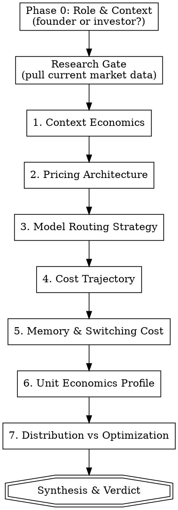

# Agent Business Canvas

An opinionated, research-backed framework for evaluating AI agent product business models. Takes sharp positions derived from real production data (20,000+ agent deployments), challenges assumptions, and produces a structured canvas document.

Adapts lens based on role:
- **Founder/builder**: "Here's what will kill you and here's what to do about it"
- **Investor/VC**: "Here's what to probe for and here are the red flags"

## When to Use

- Evaluating or designing pricing for an AI agent product
- Auditing unit economics of an agentic product
- Due diligence on an AI agent company (investor lens)
- Deciding on model routing, memory architecture, or cost structure
- Pressure-testing whether an agent business is viable

## When NOT to Use

- General SaaS pricing (no agent-specific cost dynamics)
- Evaluating non-agentic AI products (chatbots, copilots without persistence)
- Pure technical architecture review (use other skills for that)

## Process



## Phase 0: Role & Context

Ask two questions:

1. **"Are you building an agent product or evaluating one?"** This sets the lens for the entire canvas.
2. **"Describe the product in 2-3 sentences — what does the agent do, who uses it, and how is it priced today?"**

Do not proceed without both answers.

## Research Gate

Before walking the canvas, pull current market data using available research tools (last30days, x-research, web search):

- Current model pricing from Anthropic, OpenAI, Google (input/output per MTok)
- Recent public discussions on agent economics, pricing experiments
- Competitor pricing in the relevant vertical
- Any recent compute cost drops or model releases that affect the analysis

Embed findings throughout each dimension. Do not present research as a separate section — weave it into the challenges.

## The Seven Dimensions

For each dimension, follow this pattern:
1. **State the opinionated position** (bold, direct, no hedging)
2. **Ask what the user's current reality is** (or what they've observed, for investors)
3. **Challenge their answer** with data, counterpoints, and research findings
4. **Record the finding** for the canvas document

### Dimension 1: Context Economics

**Position: Session-start context rebuild is your #1 cost. If you're not measuring cost-per-session-start separately from cost-per-message, you're flying blind.**

Real-world data: ~49% of total compute in production agent deployments goes to rebuilding context at session start — who the user is, what they care about, what happened yesterday. Messages 2-50 are nearly free (97% KV-cache hits). The entire cost structure is front-loaded per session, not per message.

Challenge the user on:
- Do they know their cost-per-session-start vs cost-per-message?
- Are they pricing by messages? (Wrong unit of measurement)
- What's their KV-cache hit rate after the first message?
- How are they managing context window loading?

For investors: If the company can't answer "what percentage of compute goes to context rebuild," they haven't instrumented their costs properly. Red flag.

### Dimension 2: Pricing Architecture

**Position: Flat pricing is structurally broken for persistent agents. Your top 15% of users will eat 60%+ of compute. No flat price gets 70%+ of users to break even.**

Real-world data: At $49/month flat, only 47% of users were organically profitable in one 20k-agent deployment. The top 15% of users generated 64% of all compute. But when an "unlimited" user spends $420 on compute and wins a $200k government grant, how do you price that?

Challenge the user on:
- What's their user cost distribution? (They probably don't know)
- Have they modeled what price gets 70% of users profitable? (Probably impossible with flat pricing)
- Are they capturing value proportional to value delivered?
- What happens when their most expensive user is also their best case study?

Do NOT present neutral options A/B/C/D. Take a position: flat pricing will kill you at scale. Then help them figure out what replaces it, given their specific product.

### Dimension 3: Model Routing Strategy

**Position: You need at least two models. Users can't tell the difference between flagship models. Your moat is memory and orchestration, not model quality.**

Real-world data: One deployment swapped Opus 4.6, Gemini 3.1 Pro, and Sonnet 4.6 across 10% of users for 7 days. Zero complaints. No measurable difference in engagement between Opus and Gemini Pro. Margin jumped from 58% to 92%.

Challenge the user on:
- Are they single-model? Why? (Probably inertia or fear)
- Have they A/B tested model swaps? (If not, they're leaving 30-50% margin on the table)
- What are users actually paying for? (Not the model — the memory, orchestration, relationship)
- Do they have a premium/overflow architecture? (Every agent company needs one)

For investors: Ask if the company has tested model substitution. If they haven't, their margin story is unproven. If they have and users didn't notice, their moat claim better not be "we use the best model."

### Dimension 4: Cost Trajectory

**Position: Compute drops ~50% every 6 months. Today's margin problem solves itself in 12 months. The only race is distribution.**

Real-world data: Margins go from 58% to 89% in 12 months without changing prices, purely from compute cost drops. Every dollar spent optimizing unit economics today could be a dollar that should go to growth.

Challenge the user on:
- Are they optimizing costs or acquiring users? (Pick one — at this stage, distribution wins)
- What's their 12-month margin projection assuming current cost trends?
- Are they making architectural decisions that lock them into expensive patterns?
- Is their burn rate survivable long enough for costs to self-correct?

For investors: The question isn't "are margins good today" — it's "will this company survive long enough for compute costs to make the model work?" and "are they spending on distribution or optimization?"

### Dimension 5: Memory & Switching Cost

**Position: The agent's memory IS the product. At sufficient depth, switching cost becomes infinite. This determines your retention model and your actual moat.**

Challenge the user on:
- How deep is the agent's knowledge of each user? (Surface preferences vs. deep understanding)
- At what point does a user feel they "can't leave"? (When the agent knows their health? Their business? Their Tuesday routine?)
- Are they building structured memory or just accumulating chat logs?
- What's the cost of running one persistent agent that fully knows a human? ($13/month on premium, $3 on lighter model — at what point does this become a utility?)

For investors: The switching cost thesis is the entire bull case. If the memory is shallow or unstructured, switching cost is low and churn will be high. Probe depth.

### Dimension 6: Unit Economics Profile

**Position: You must map your user distribution. Averages lie. The whale tail determines everything.**

Challenge the user on:
- What % of users are profitable at current pricing?
- What does the top 10% cost vs. the bottom 50%?
- What's the value-to-compute ratio for power users? (A user spending $420 in compute who wins $200k in grants is wildly profitable on a value basis, even if unprofitable on a unit basis)
- Are their most expensive users also their highest-value users? (Often yes — which breaks simple cost-cutting logic)

For investors: Ask for the cost distribution curve. If the company shows averages, they're hiding the whale problem. A healthy agent company knows their percentiles.

### Dimension 7: Distribution vs. Optimization

**Position: Every dollar spent on cost optimization today is a dollar that probably should go to distribution. Prove me wrong.**

Challenge the user on:
- What's their current growth rate?
- What's their CAC and where are users coming from?
- Are they spending engineering time on cost optimization or product/growth?
- If compute costs halve in 6 months, what was the ROI on that optimization work?
- Is there a scenario where optimizing NOW is correct? (Yes: if burn rate doesn't survive to the cost drop)

For investors: Is this team building or optimizing? Builders win in expanding markets. Optimizers win in mature ones. The agent market is expanding.

## Synthesis & Verdict

After all seven dimensions, produce a verdict section.

**For founders:**
```
WHAT WILL KILL YOU FIRST:
1. [Ranked by urgency, not importance]
2. ...

YOUR UNFAIR ADVANTAGE:
- [What you have that's genuinely hard to replicate]

RECOMMENDED NEXT MOVES (next 30 days):
1. [Concrete, actionable]
2. ...
3. ...
```

**For investors:**
```
DILIGENCE PROBES:
1. [Questions to ask, ranked by signal value]
2. ...

RED FLAGS:
- [What you saw that concerns you]

YELLOW FLAGS:
- [Worth monitoring]

GREEN FLAGS:
- [What looks strong]

INVESTMENT THESIS IN ONE SENTENCE:
[Bull case] vs [Bear case]
```

## Output Document

Save the completed canvas as `agent-business-canvas-YYYY-MM-DD.md` in the current working directory (or a location the user specifies).

Structure:

```markdown
# Agent Business Canvas — [Product Name]
**Date:** YYYY-MM-DD
**Role:** Founder | Investor
**Product:** [2-3 sentence description]

## 1. Context Economics
**Position:** [The opinionated default]
**Your Reality:** [What the user reported]
**Challenge:** [How we pressure-tested it]
**Market Data:** [Research findings with sources]
**Verdict:** [Synthesized finding for this dimension]

## 2. Pricing Architecture
[same structure]

## 3. Model Routing Strategy
[same structure]

## 4. Cost Trajectory
[same structure]

## 5. Memory & Switching Cost
[same structure]

## 6. Unit Economics Profile
[same structure]

## 7. Distribution vs. Optimization
[same structure]

## Synthesis
[Role-appropriate verdict from above]
```

## Pacing

- Present each dimension's position, then ask for the user's reality, then challenge
- Don't rush — each dimension is a mini-conversation, not a form field
- If the user wants to drill into one dimension, do it, then resume
- The whole canvas should take 15-30 minutes of conversation
- Momentum matters — don't let any single dimension become a 20-minute detour

## Common Mistakes

- **Being neutral when you should be opinionated**: This skill takes positions. "It depends" is not an answer. State your position, then let the user push back.
- **Skipping research**: Current model pricing and market data ground the analysis. Without it, you're just theorizing.
- **Presenting options without a recommendation**: Always lead with what you'd do and why.
- **Averaging user economics**: Averages hide the whale problem. Always push for distribution data.
- **Treating all dimensions equally**: Some will be more relevant than others for a given product. Spend more time where the pain is.
