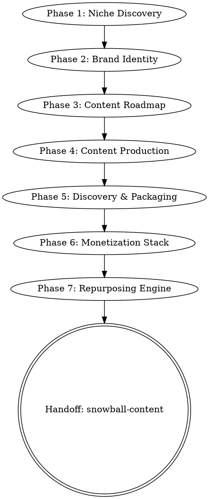

# Content Creator Launchpad

Build a content brand from zero across any platform through a guided 7-phase pipeline. Each phase produces a concrete artifact that feeds the next.

## Supported Platforms

| Platform | Key Adaptations |
|----------|----------------|
| **YouTube** | Thumbnails, watch time optimization, end screens, Shorts strategy |
| **Podcast** | Episode structure, show notes, guest strategy, RSS/distribution |
| **Newsletter** | Subject lines, open rates, lead magnets, landing pages |
| **TikTok/Shorts** | Hook-first scripting, trends, sounds, posting cadence |
| **Blog** | SEO-first titles, internal linking, pillar/cluster strategy |

## Entry

Ask 3 questions before starting:

1. **Platform(s):** Which platform(s) are you building on? (YouTube, Podcast, Newsletter, TikTok/Shorts, Blog — pick 1-3)
2. **Niche interest:** What's your niche or area of interest? (vague is fine — "I'm into fitness" works)
3. **Context:** What's your situation? (brand new / have some content / established but pivoting)

Then proceed to Phase 1.

## Skip Protocol

User can say "skip to phase N" at any time. When they do:
- Identify what context is missing from skipped phases
- Ask only the essential questions to fill the gap (niche? brand name? voice?)
- Resume at the requested phase

## The 7 Phases

Each phase: explain what we're doing and why, generate the artifact, get user approval or tweaks, then advance.

Save all outputs to `content-launchpad/` directory as numbered markdown files.

### Phase 1: Niche Discovery

**Prompt framework:**
Analyze the top 10 niches within the user's interest area for their chosen platform(s). For each niche, provide:

| Factor | Detail |
|--------|--------|
| Revenue potential | CPM/sponsorship rates (YouTube), ad rates (podcast), conversion rates (newsletter), brand deal ranges (TikTok), affiliate potential (blog) |
| Competition level | Low / Medium / High with reasoning |
| Evergreen demand | Trend data, seasonality |
| Monetization paths | Beyond primary platform revenue — at least 3 per niche |
| 3-word concept | Channel/show/publication concept in 3 words |

**Output:** `content-launchpad/01-niche-analysis.md`

End with a recommendation. Ask the user to pick or refine before proceeding.

### Phase 2: Brand Identity

Using the chosen niche, generate:

- **Name:** 5 options (check availability note: suggest user verify handles/domains)
- **Tagline:** One line that communicates the value proposition
- **Audience persona:** Specific person, not a demographic. Name them. What do they google at 2am?
- **Content pillars:** 4 recurring themes that define the brand's territory
- **Differentiator:** The "unique mechanism" — what makes this creator's take different from everyone else in this niche

Adapt for platform:
- YouTube/Podcast: channel name + show format (solo, interview, documentary, etc.)
- Newsletter: publication name + send frequency + preview of voice
- TikTok: handle + content format (POV, tutorial, react, stitch, etc.)
- Blog: site name + content structure (pillar pages, series, etc.)

**Output:** `content-launchpad/02-brand-identity.md`

### Phase 3: Content Roadmap

Build a 90-day content calendar:

- **12+ content titles** optimized for the platform's discovery mechanism (SEO for YouTube/Blog, algorithm for TikTok, subject lines for Newsletter)
- **Upload/publish schedule** appropriate to platform norms and realistic for a new creator
- **Discovery vs. virality balance:** Mark each piece as "search/SEO play" or "share/viral play"
- **Authority progression:** Content builds expertise perception over time — early pieces establish credibility, later pieces assume audience trust

Platform-specific calendar format:
- YouTube: video titles, estimated length, thumbnail concept notes
- Podcast: episode titles, format (solo/interview/panel), guest suggestions
- Newsletter: subject lines, content type (essay/curated/interview), send day
- TikTok: hook text, format, trending audio suggestions, posting time
- Blog: titles, target keywords, word count range, internal link targets

**Output:** `content-launchpad/03-content-roadmap.md`

### Phase 4: Content Production

Create a reusable production system for the user's platform:

**YouTube script structure:**
- Hook (first 30 seconds — stop the scroll)
- Problem agitation
- Solution walkthrough
- 3 key insights
- CTA
- End screen tease for next video

**Podcast episode structure:**
- Cold open / teaser clip
- Intro + episode framing
- Segment 1-3 with transitions
- Listener CTA
- Outro with next episode preview

**Newsletter structure:**
- Subject line + preview text
- Opening hook (1-2 sentences)
- Main content section
- One clear CTA
- PS line (highest-read section after subject line)

**TikTok/Shorts structure:**
- Hook (first 1-3 seconds)
- Setup (the problem/question)
- Payoff (the answer/reveal)
- CTA or loop trigger

**Blog structure:**
- H1 + meta description
- Hook paragraph
- Table of contents
- Sections with H2/H3 hierarchy
- Key takeaways box
- CTA

Generate one complete example using a title from the Phase 3 roadmap. Set the tone based on Phase 2 brand identity.

**Output:** `content-launchpad/04-production-system.md`

### Phase 5: Discovery & Packaging

For the first 3 pieces from the roadmap, generate:

**All platforms:**
- 3 title/headline variations for A/B testing
- Platform-optimized description/show notes/meta description with keywords

**Platform-specific:**
- **YouTube:** 3 thumbnail concepts with text overlay copy, 10 tags, timestamps template
- **Podcast:** Cover art direction, episode description template, show notes with chapters
- **Newsletter:** Subject line A/B variants, preview text, send time recommendation
- **TikTok:** Caption with hashtags, cover frame text, sound suggestions
- **Blog:** Meta title/description, OG image concept, internal/external link targets, schema markup suggestions

**Output:** `content-launchpad/05-discovery-packaging.md`

### Phase 6: Monetization Stack

Build a monetization roadmap based on the brand identity and platform(s):

| Stream | When to Start | What to Build | Expected Revenue Range |
|--------|--------------|---------------|----------------------|
| Primary platform revenue | Day 1 setup | AdSense/Spotify/paid newsletter/display ads | Platform-specific estimates |
| Affiliate | Month 1 | Relevant product recommendations with disclosure | Per-niche estimates |
| Digital product | Month 2-3 | Course, template, guide, toolkit — based on content pillars | Price range suggestion |
| Sponsorship | Month 3+ | Pitch template + rate card based on niche CPMs | Per-1000 rates |
| Email list | Day 1 | Lead magnet idea tied to content pillars | List building targets |
| Community/membership | Month 6+ | Platform recommendation (Discord, Patreon, Substack, etc.) | Tier structure |

Include a **sponsorship pitch template** and a **lead magnet concept** tied to the brand.

**Output:** `content-launchpad/06-monetization-stack.md`

### Phase 7: Repurposing Engine

Take one piece of content from the roadmap and demonstrate how to repurpose it into 7+ pieces across platforms:

| Source Format | Repurposed Into | Platform | Adaptation Notes |
|--------------|-----------------|----------|-----------------|
| Long-form video | 3 short clips | TikTok/Shorts/Reels | Hook-first edits |
| Long-form video | Thread | X/Twitter | Key insights as numbered list |
| Long-form video | Post | LinkedIn | Professional angle, personal story |
| Long-form video | Newsletter | Email | Summary + exclusive insight |
| Long-form video | Blog post | Website | SEO-optimized transcript expansion |
| Long-form video | Carousel | Instagram | Visual key takeaways |
| Long-form video | Pin | Pinterest | Infographic or quote card |

Adapt the source format column to whatever the user's primary platform is.

**After completing Phase 7:** Suggest invoking `snowball-content` to build the ongoing content multiplication flywheel. The launchpad builds the brand; snowball keeps it fed.

**Output:** `content-launchpad/07-repurposing-engine.md`

## Common Mistakes

| Mistake | Fix |
|---------|-----|
| Generic niche ("fitness") | Push deeper: "mobility for desk workers over 35" |
| Brand identity that sounds like everyone else | The differentiator must be specific and defensible |
| Unrealistic posting schedule | Match to platform norms AND creator capacity |
| Monetization too early | Build audience trust first — the roadmap has timing for a reason |
| Repurposing = copy-paste | Each platform needs native adaptation, not just re-posting |
| Skipping discovery/packaging | The best content fails without discoverability |
