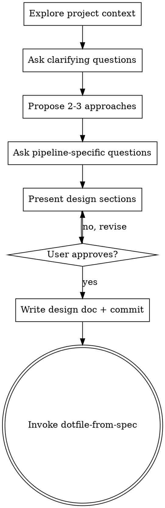

# dotfile-brainstorm

Brainstorm a project idea into a design doc structured for pipeline DOT generation, then chain into `dotfile-from-spec` to produce the actual DOT file.

## What This Produces

A design doc with standard sections (architecture, components, testing) PLUS a **Pipeline Configuration** section that captures everything `dotfile-from-spec` needs. The design doc is the handoff artifact.

## Critical Context: What Is a Pipeline DOT File?

**This is an LLM pipeline runner, NOT a CI/CD system.** Each node in the pipeline is an AI task with a self-contained prompt that executes headlessly. The pipeline **builds the software from scratch** — plan, scaffold, write tests, implement, verify, commit, review, ship.

This is NOT:
- A CI/CD pipeline (lint → test → build → deploy)
- An architecture diagram (service A → queue → service B)
- A GitHub Actions workflow

This IS:
- A sequence of LLM coding tasks that autonomously construct a working project
- Each node has a `prompt` attribute telling the AI what to do
- Human gates (`wait.human`) let a person approve/reject at key points
- Conditional nodes route based on success/failure
- Parallel fan-out/fan-in for independent workstreams

**If you catch yourself designing a CI/CD pipeline, STOP.** You are designing a build pipeline where AI agents write the code.

## Anti-Pattern: "This Is Too Simple to Brainstorm"

Every project goes through this process. A single-function CLI, a config change, a "quick" utility — all of them. "Simple" projects are where unexamined assumptions cause the most wasted work. The design can be short (a few sentences for truly simple projects), but you MUST present it and get approval before generating any DOT output.

If you're thinking "I can just skip to DOT generation," that's the signal you need brainstorming most.

## Process Flow



## Checklist

1. Explore project context (files, docs, recent commits)
2. Ask clarifying questions — one at a time, prefer multiple choice
3. Propose 2-3 approaches with trade-offs and recommendation
4. Ask pipeline-specific questions (see Pipeline Questions below)
5. Present design sections including Pipeline Configuration, get user approval after each
6. Write design doc to `docs/plans/YYYY-MM-DD-<topic>-design.md`
7. Commit the design doc
8. Invoke `dotfile-from-spec` with the design doc

## Hard Gate

<HARD-GATE>
Do NOT invoke dotfile-from-spec, generate any DOT output, or take any implementation
action until you have presented the complete design (including Pipeline Configuration)
and the user has approved it.
</HARD-GATE>

## Brainstorming Process

### Phase 1: Understand the Idea

Standard brainstorming — understand what we're building:
- Purpose and goals
- Constraints and non-goals
- Success criteria
- Architecture and components
- Data model / storage
- Error handling strategy

Ask questions **one at a time**. Prefer multiple choice when possible.

### Phase 2: Pipeline-Specific Questions

After you understand the project, ask these questions to fill the Pipeline Configuration section. These are the questions agents naturally skip without guidance:

**Build Phases:**
- What are the major build phases? (Plan → Setup → Implement features → Verify → Ship)
- Can any features be implemented in parallel, or must they be sequential?
- Are there natural groupings (e.g., "backend first, then frontend")?

**Testing Strategy (for TDD enforcement):**
- What test frameworks? (pytest, jest, go test, etc.)
- What levels of testing? (unit, integration, e2e)
- What coverage threshold?

**Quality Tools:**
- Linter? (ruff, eslint, biome, etc.)
- Formatter? (ruff format, prettier, etc.)
- Type checker? (mypy, pyright, tsc, etc.)
- Pre-commit hooks? (yes/no, which tools)

**Human Approval Gates:**
The default is **no human gates** — the pipeline runs fully autonomously. Only add gates if the user explicitly wants them.

Ask: "Do you want any human approval checkpoints, or should this run fully headless?" If they want gates:

| Project Complexity | Suggested Gates |
|--------------------|----------------|
| Simple (single component) | 1 gate: pre-ship review |
| Medium (2-3 components) | 2 gates: post-design + pre-ship |
| Complex (multi-service) | 3+ gates: post-design + per-component + pre-ship |

**Recommend headless** unless the user has a specific reason for human review.

**Model Preferences:**
Which LLM models for which pipeline tasks?
- Planning/reasoning tasks (e.g., Sonnet for speed, Opus for depth)
- Code implementation tasks
- Code review tasks
- Default model for everything else

**Retry Strategy:**
- How many retries before human intervention? (suggest 3)
- Where should the pipeline retry from on failure? (suggest: retry from the failing implement node, not from start)

**Parallelism:**
- Are there independent features/components that can be built simultaneously?
- If so, identify fan-out (start parallel) and fan-in (join) points

### Phase 3: Present Design

Present the design in sections. After each section, ask if it looks right. Cover:
1. Architecture and components
2. Tech stack with justification
3. Testing strategy
4. Pipeline Configuration (all the above pipeline concerns in one structured block)

### Phase 4: Write Design Doc

Save to `docs/plans/YYYY-MM-DD-<topic>-design.md` with this structure:

```markdown
# [Project Name] Design

## Overview
[1-2 paragraphs: what we're building and why]

## Architecture
[Components, data flow, key decisions]

## Tech Stack
[Language, framework, deps — with rationale]

## Components
[Detailed component specs]

## Error Handling
[Error categories and strategies]

## Testing Strategy
[Test types, frameworks, coverage targets]

## Pipeline Configuration

This section captures everything needed for pipeline DOT generation. The pipeline describes how AI agents will autonomously build this project from scratch — NOT a CI/CD deployment pipeline.

- **Phases:** [ordered list: plan, setup, implement_X, implement_Y, verify, review, ship]
- **Tech Stack:** [language, framework, key deps — repeated here for DOT prompt generation]
- **Testing:** [frameworks and levels — e.g., "pytest: unit + integration, playwright: e2e"]
- **Quality Gates:** [linter, formatter, typechecker, pre-commit hooks]
- **Human Gates:** [where human approval is required — e.g., "post-design, pre-ship"]
- **Retry Strategy:** [max retries, retry target node — e.g., "max 3, retry from implement"]
- **Models:** [which models for which tasks — e.g., "Opus for code, Sonnet for planning"]
- **Parallelism:** [independent workstreams — e.g., "backend and frontend in parallel after setup"]
```

## Terminal Action

After writing and committing the design doc, invoke `dotfile-from-spec` to generate the DOT file. No other skills get invoked after this one — `dotfile-from-spec` is the next and only step.

## Common Mistakes

| Mistake | Fix |
|---------|-----|
| Designing a CI/CD pipeline instead of an AI build pipeline | The pipeline builds the code with AI agents — plan, implement, test, commit. NOT lint → test → deploy. |
| Designing an architecture diagram instead of a build pipeline | Architecture shows runtime data flow. Build pipeline shows how AI constructs the project step by step. |
| Skipping Pipeline Configuration section | This section is required. Without it, dotfile-from-spec will need to ask follow-up questions. |
| Not asking about human gates | Always ask. Users often want review points but won't think to mention them. |
| Not asking about model preferences | Different tasks benefit from different models. Ask. |
| Starting DOT generation before design approval | Hard gate. Design must be approved first. |
| Assuming linear pipeline when parallelism is possible | Multi-component projects often have independent workstreams. Ask about parallelism. |
| Omitting parallelism reasoning when linear is correct | If the pipeline is linear, explain WHY (e.g., "components are tightly coupled"). Don't just leave the field blank. |
