# dotfile-from-spec

Generate validated pipeline DOT files from structured specs and design docs. Every node prompt is packed with enough context for fully autonomous headless execution. Incorporates proven patterns from the dotpowers pipeline family.

## Checklist

1. Read the spec/design doc thoroughly
2. **Scope analysis** — identify what's v1 vs nice-to-have. Cut aggressively. A 921-line MVP beats a 7K monolith.
3. Extract pipeline phases (plan, setup, implement per feature, verify, commit, review, release)
4. **Map dependencies** — which components depend on others? Model with fan-out/join nodes, not linear chains.
5. Determine core tech stack (language, framework, deps) — bake into every prompt
6. Ask user: **Where should human approval gates go?** (suggest based on complexity)
7. Ask user: **Which LLM models?** (generate `model_stylesheet`)
8. **Select pipeline topology** — see Pipeline Topology Guide below
9. Generate the DOT file following the reference below, incorporating **Proven Patterns**
10. **Reconcile DOT against spec** — see Spec Reconciliation below
11. Run `dotfile validate <file>.dot` — fix ALL errors
12. Save to project root (e.g., `pipeline.dot` or `build_<project>.dot`)

## DOT Runtime Reference

### Node Shapes → Handlers

| Shape | Handler | Purpose | Required Attributes |
|-------|---------|---------|-------------------|
| `Mdiamond` | start | Pipeline entry point (exactly one) | `label` |
| `Msquare` | exit | Pipeline exit, validates goal gates (exactly one) | `label` |
| `box` | codergen | LLM coding/reasoning tasks (DEFAULT) | `prompt`, `label` |
| `diamond` | conditional | Routes by edge conditions | `prompt`, `label` |
| `hexagon` | wait.human | Human approval gate | `label`, **`type="wait.human"`** |
| `parallelogram` | tool | Shell command execution | `label`, `tool_command` |
| `component` | parallel | Fan-out (parallel start) | `label` |
| `tripleoctagon` | parallel.fan_in | Fan-in (parallel join) | `label` |

**CRITICAL:** Hexagon nodes MUST have `type="wait.human"` — shape alone is not enough.

### Graph Attributes

| Attribute | Type | Purpose | Example |
|-----------|------|---------|---------|
| `goal` | string | Pipeline success criteria | `"Build working CLI with tests"` |
| `label` | string | Pipeline display name | `"Build URL Title CLI"` |
| `model_stylesheet` | string | CSS-like model config | See Model Stylesheet section |
| `default_max_retry` | int | Global retry limit (default=50) | `default_max_retry=3` |
| `retry_target` | string | Node to retry from on failure | `retry_target=implement` |
| `fallback_retry_target` | string | Fallback retry node | |
| `default_fidelity` | string | Context fidelity level | `full`, `summary:high`, `summary:compact` |
| `rankdir` | string | Layout direction | `TB` (top-bottom), `LR` (left-right) |

### Node Attributes

| Attribute | Type | Purpose |
|-----------|------|---------|
| `prompt` | string | LLM instruction (the core of headless building) |
| `label` | string | Display name |
| `shape` | string | Handler type (see table above) |
| `type` | string | Explicit handler override (e.g., `"wait.human"`) |
| `class` | string | Model stylesheet class (e.g., `class="code"`) |
| `goal_gate` | bool | Must pass for pipeline success |
| `max_retries` | int | Per-node retry limit |
| `timeout` | duration | Node timeout (e.g., `"30m"`, `"1h"`) |
| `retry_target` | string | Where to retry from on failure |
| `fallback_retry_target` | string | Fallback retry node |
| `llm_model` | string | Override model for this node |
| `llm_provider` | string | Model provider |
| `reasoning_effort` | string | `low`, `medium`, or `high` |
| `fidelity` | string | `full`, `summary:high`, `summary:compact` |
| `auto_status` | bool | Auto-report status |
| `allow_partial` | bool | Accept partial completion |
| `system_prompt` | string | System prompt override |
| `tool_command` | string | Shell command (for `parallelogram` tool nodes) |
| `thread_id` | string | Conversation thread ID |

### Edge Attributes

| Attribute | Type | Purpose | Example |
|-----------|------|---------|---------|
| `label` | string | Edge display label | `label="tests pass"` |
| `condition` | string | Routing condition | `condition="outcome=success"` |
| `weight` | int | Preferred path (higher = preferred) | `weight=2` |
| `fidelity` | string | Context fidelity for this edge | |
| `thread_id` | string | Thread for context | |
| `loop_restart` | bool | Restart loop detection | |

### Edge Condition Syntax

```
condition="outcome=success"         // case-insensitive equality
condition="outcome=fail"
condition="outcome!=success"        // inequality
condition="context.some_key=value"  // context variable check
```

Operators: `=` (equality), `!=` (inequality). Outcome and preferred_label comparisons are case-insensitive.

### Human Gate Edge Labels

Use accelerator key format. Set higher weight on the preferred (happy) path:

```dot
human_review -> next_step [label="[A] Approve", condition="outcome=Approve", weight=2];
human_review -> revise [label="[R] Revise", condition="outcome=Revise"];
human_review -> fix [label="[F] Fix", condition="outcome=Fix"];
```

## Prompt Engineering Guide

Each node prompt must be **self-contained** — it executes in isolation. Pack maximum context.

### Required Elements in Every Build/Verify Prompt

1. **Working directory:** Always reference `run.working_dir` (the pipeline engine substitutes this with the actual path at runtime)
2. **TDD enforcement:** "Write failing test FIRST, then implement minimally to pass"
3. **Quality requirements:** "Run [linter] and [formatter] before committing. Fix all issues."
4. **Commit instructions:** "Commit with conventional commit format: `type(scope): description`"
5. **Tech stack:** Name the language, framework, and key deps explicitly
6. **Pre-commit hooks:** Setup node should install and configure pre-commit hooks

### Prompt Template

```
prompt="You are working in `run.working_dir`.

## Task
[Clear, specific task description]

## Tech Stack
[Language] with [framework]. Dependencies: [list].

## Process
1. Write failing tests FIRST using [test framework]
2. Run tests to confirm they fail
3. Implement minimum code to pass tests
4. Run [linter] and [formatter] — fix all issues
5. Run full test suite
6. Commit: git add -A && git commit -m '<type>(<scope>): <description>'

## Success Criteria
[What done looks like — be specific]
"
```

## Pipeline Topology Guide

Choose topology based on project complexity. These patterns are proven across production pipeline runs.

### Linear (Small Projects, 1-3 Components)

```
start -> plan -> setup -> implement -> verify -> commit -> review -> done
```

Use when: Single component, few files, simple dependencies. The dotpowers-simple-auto pattern.

### Linear with Fan-Outs (Medium Projects, 4-8 Components)

```
start -> plan -> setup -> foundation -> verify_foundation
  -> [fan-out: independent components in parallel]
  -> [fan-in] -> verify -> commit -> review -> done
```

Use when: Multiple independent components that share a foundation but don't depend on each other. Example: 6 views that all need the DB layer but don't need each other.

### Dependency DAG (Large Projects, 8+ Components with Cross-Dependencies)

```
start -> plan -> setup -> foundation -> verify_foundation
  -> [fan-out: parallel tracks]
  -> [join nodes where tracks converge]
  -> [fan-out: dependent features]
  -> [join_all] -> polish -> e2e -> verify_final -> done
```

Use when: Components have real dependencies (e.g., can't build Nightly Sync without Google Drive AND Calendar). Model dependencies explicitly with `tripleoctagon` join nodes.

**Join node pattern:**
```dot
join_sync_deps [shape=tripleoctagon, label="Join: Drive + Categorization"];
commit_drive -> join_sync_deps;
commit_calendar -> join_sync_deps;
join_sync_deps -> implement_nightly_sync;
```

### When NOT to Generate a Project-Specific DAG

If the project fits naturally into the dotpowers family (brainstorm -> plan -> implement loop -> review), use a dotpowers variant directly instead of generating a custom DAG. Project-specific DAGs are for when you need:
- Explicit dependency modeling between components
- Domain-specific sprint prompts with detailed specs
- Custom parallelism patterns that dotpowers' task loop can't express

## Proven Patterns from Production

These patterns are extracted from the dotpowers pipeline family and validated across multiple production runs. **Incorporate them into every generated DAG.**

### 1. Scope Gating (First Phase)

The single highest-leverage pattern. A scoped MVP beats a monolith every time.

If the spec is large, add a scoping node early:
```dot
scope_analysis [shape=box, class="review",
    label="Scope Analysis",
    goal_gate=true, retry_target="scope_analysis",
    prompt="You are working in `run.working_dir`.
## Task
Read the spec and identify what's strictly needed for v1.
Apply YAGNI ruthlessly — cut anything not core to the primary use case.
Write a scoped feature list to docs/plans/scope.md with IN/OUT sections.
"];
```

### 2. Per-Phase Verification Gates

Add a `diamond` verify node after each major implementation phase, not just at the end. Granular gates catch issues earlier.

```dot
verify_phase [shape=diamond,
    label="Phase N Tests Pass?",
    prompt="You are working in `run.working_dir`.
Run:
1. [test command] -v --tb=short
2. [linter command]
If ALL pass: outcome=success
If ANY fail: outcome=fail"];

verify_phase -> commit_phase [label="pass", condition="outcome=success", weight=2];
verify_phase -> implement_phase [label="fix", condition="outcome=fail"];
```

### 3. Graduated Escalation Path

Don't just retry the same node. Use debug -> replan -> human help:

```dot
implement -> debug_investigate [condition="outcome=fail", label="retries exhausted"];
debug_investigate -> implement [condition="outcome=success", label="fixed"];
debug_investigate -> replan_task [condition="outcome=fail", label="can't fix"];
replan_task -> implement [condition="outcome=success", label="replanned"];
replan_task -> human_help [condition="outcome=fail", label="stuck"];
```

### 4. Budget Tracking (Prevent Infinite Loops)

Add parallelogram budget counters before retry loops:

```dot
check_budget [shape=parallelogram,
    label="Check Retry Budget",
    tool_command="#!/bin/sh\nset -eu\nmkdir -p .tracker\nCOUNTER='.tracker/impl_count'\ncount=0\n[ -f \"$COUNTER\" ] && count=$(cat \"$COUNTER\")\ncount=$((count + 1))\nprintf '%s' \"$count\" > \"$COUNTER\"\nif [ \"$count\" -gt 5 ]; then\n  printf 'budget_exhausted'\nelse\n  printf 'budget_ok'\nfi"];

check_budget -> implement [label="retry ok", condition="context.tool_stdout=budget_ok", weight=2];
check_budget -> human_help [label="too many attempts", condition="context.tool_stdout=budget_exhausted"];
```

### 5. Plan Format Validation

Validate that generated plans don't handwave. Catches "implement the logic" and "add appropriate validation":

```dot
validate_plan [shape=parallelogram,
    label="Validate Plan Format",
    tool_command="#!/bin/sh\nset -eu\nPLAN='docs/plans/plan.md'\nif [ ! -s \"$PLAN\" ]; then printf 'fail_no_plan'; exit 0; fi\ncount=$(grep -c '^- \\[ \\] task-[0-9]\\+:' \"$PLAN\" || true)\nif [ \"$count\" -eq 0 ]; then printf 'fail_no_checkboxes'; exit 0; fi\nhandwaves=$(grep -ciE '(write a complete implementation|add appropriate|add validation logic|add error handling logic|add the logic)' \"$PLAN\" || true)\nif [ \"$handwaves\" -gt 0 ]; then printf 'fail_handwaves'; exit 0; fi\nprintf 'format_ok'"];
```

### 6. Review Nodes Must Read Code

Reviews that don't read source files are rubber stamps. Every review prompt MUST include:

```
## IRON LAW: NO COMPLETION CLAIMS WITHOUT FRESH VERIFICATION
Run commands. Read output. Check exit codes. THEN make claims.

## Context (MANDATORY — do this FIRST)
1. Get the full diff: git diff main...HEAD (or first commit)
2. Read every changed file
3. Run the test suite yourself
DO NOT trust the implementer's claims. Verify independently.
```

### 7. Language-Aware Build Validation

Use a parallelogram that detects the build system. **CRITICAL: Use `set +e` and capture exit codes — never `exit 1`. A non-zero exit crashes the tool node instead of routing.**

```dot
validate_build [shape=parallelogram,
    label="Validate Full Build",
    tool_command="#!/bin/sh\nset +e\nfail=0\nif [ -f pyproject.toml ]; then\n  uv run pytest -v 2>&1 || fail=1\n  uv run ruff check . 2>&1 || fail=1\n  uv run mypy src/ 2>&1 || fail=1\n  if [ \"$fail\" -eq 0 ]; then printf 'validation-pass'; else printf 'validation-fail'; fi\nelif [ -f go.mod ]; then\n  go build ./... 2>&1 || fail=1\n  go test ./... 2>&1 || fail=1\n  go vet ./... 2>&1 || fail=1\n  if [ \"$fail\" -eq 0 ]; then printf 'validation-pass'; else printf 'validation-fail'; fi\nelif [ -f package.json ]; then\n  npm test 2>&1 || fail=1\n  if [ \"$fail\" -eq 0 ]; then printf 'validation-pass'; else printf 'validation-fail'; fi\nelif [ -f Cargo.toml ]; then\n  cargo build 2>&1 || fail=1\n  cargo test 2>&1 || fail=1\n  if [ \"$fail\" -eq 0 ]; then printf 'validation-pass'; else printf 'validation-fail'; fi\nelse\n  printf 'validation-unknown'\nfi"];
```

Output must be one of: `validation-pass`, `validation-fail`, `validation-unknown`. Route on these with edge conditions.

### 8. Resume Support

Add a CheckExistingPlans node at the start so interrupted pipelines can resume:

```dot
check_existing [shape=parallelogram,
    label="Check Existing Plans",
    tool_command="#!/bin/sh\nif [ -f docs/plans/plan.md ] && grep -q '^- \\[ \\]' docs/plans/plan.md 2>/dev/null; then\n  printf 'resume'\nelse\n  printf 'fresh'\nfi"];

start -> check_existing;
check_existing -> pick_next_task [label="resume", condition="context.tool_stdout=resume", weight=2];
check_existing -> plan_phase [label="fresh", condition="context.tool_stdout=fresh"];
```

## Model Stylesheet Guide

Ask the user which models they want. Generate a CSS-like stylesheet:

```
model_stylesheet="
    * { llm_model: claude-sonnet-4-5; llm_provider: anthropic; }
    .code { llm_model: claude-opus-4-6; llm_provider: anthropic; }
    .review { llm_model: claude-opus-4-6; reasoning_effort: high; }
    #critical_node { llm_model: claude-opus-4-6; reasoning_effort: high; }
"
```

**Selectors:** `*` (all nodes), `.classname` (by class), `#nodeID` (by ID). Highest specificity wins.

Assign classes with `class="code"` on nodes. Planning/simple nodes use default (`*`), implementation nodes use `.code`, review nodes use `.review`.

## Human Gate Configuration

**Default: no human gates.** The pipeline runs fully autonomously. Only add gates if the user explicitly requests them.

If the user wants gates, suggest based on complexity:

| Project Complexity | Suggested Gates |
|--------------------|----------------|
| Simple (single component) | 1 gate: pre-ship review |
| Medium (2-3 components) | 2 gates: design approval + pre-ship review |
| Complex (multi-service/parallel) | 3+ gates: design + per-component review + pre-ship |

**Recommend headless** unless the user has a specific reason for human review.

## COMMIT NODES — Every Phase Gets a Commit

**Commits are pipeline steps, not afterthoughts.** After every implementation and verification phase, add an explicit commit node.

```dot
implement_feature [shape=box, class="code",
    prompt="...implement the feature...",
    label="Implement Feature"];

commit_feature [shape=box, class="code",
    prompt="You are working in `run.working_dir`.

Review all changes with git diff. Stage all relevant files.
Commit with conventional commit format:
git add -A && git commit -m 'feat(feature): implement feature per spec'

Do NOT commit generated files, node_modules, __pycache__, or .env files.
Verify the commit succeeded with git log --oneline -1."
    label="Commit Feature"];

implement_feature -> commit_feature;
```

**Pattern:** `implement_X → verify_X → commit_X → next_phase`

## Failure Handling — Every Box Node Needs a Failure Path

**Every `box` (codergen) node MUST have a failure path.** Without one, validation will warn that a node failure aborts the pipeline. There are two approaches — use one or the other for every box node:

**Option A: `goal_gate=true` + `retry_target`** (preferred for implement/verify/commit nodes)
```dot
implement_feature [shape=box, class="code",
    goal_gate=true,
    retry_target="implement_feature",
    prompt="...",
    label="Implement Feature"];
```
The pipeline engine will automatically retry from the specified node on failure.

**Option B: Explicit fail edge** (for conditional routing)
```dot
verify_feature -> commit_feature [label="pass", condition="outcome=success", weight=2];
verify_feature -> implement_feature [label="fix issues", condition="outcome=fail"];
```

**Rule of thumb:**
- `diamond` (conditional) nodes: use explicit fail edges (Option B) — they route by design
- `box` (codergen) nodes that implement/test/commit: use `goal_gate=true` + `retry_target` (Option A)
- When in doubt, use Option A — it's simpler and covers most cases

**Do NOT leave any box node without either `goal_gate=true`+`retry_target` OR an outgoing fail edge.**

## Setup Node Must Include Pre-commit Hooks

The setup/scaffold node prompt should always include:

```
Set up pre-commit hooks for code quality:
- Install pre-commit (or equivalent for the language)
- Configure hooks for: [linter], [formatter], [type checker]
- Run pre-commit install
- Verify hooks work with a test commit
```

## Spec Reconciliation

After generating the DOT file, reconcile it against the spec to ensure 100% coverage. Go through each check and fix any gaps before moving to validation.

**Phases → Nodes:**
For every phase listed in Pipeline Configuration (or extracted from the spec), confirm a corresponding node exists in the DOT. Print a checklist:
```
[x] plan → plan node
[x] setup → setup node
[x] implement_backend → implement_backend node
[ ] implement_frontend → MISSING — add node
```

**Components → Implement + Test + Commit:**
For every component described in the spec, confirm the DOT has implement, test (or verify), and commit nodes. A component with no test node means TDD isn't enforced for it.

**Tech Stack → Prompts:**
Verify that every node prompt referencing code mentions the correct language, framework, and key dependencies from the spec. Spot-check at least 3 implement node prompts.

**Quality Gates → Verify Prompts:**
Confirm that every quality tool from the spec (linter, formatter, type checker, pre-commit) appears in at least one verify/conditional node prompt.

**Testing Frameworks → Test Prompts:**
Confirm that each test framework from the spec is referenced in the appropriate test node prompts (e.g., pytest in backend test nodes, vitest in frontend test nodes).

**Parallelism → Fan-out/Fan-in:**
If the spec describes parallel workstreams, confirm there is a `component` (fan-out) node and a `tripleoctagon` (fan-in) node with the correct edges connecting the parallel tracks.

**Models → Stylesheet + Classes:**
Confirm `model_stylesheet` reflects the spec's model preferences. Confirm implementation nodes have `class="code"`, review nodes have `class="review"`, and planning nodes use the default.

**Human Gates → Hexagon Nodes:**
If the user requested human gates, confirm each one exists as a `hexagon` node with `type="wait.human"`. If they didn't request gates, confirm none are present.

**Proven Patterns → Pipeline:**
Verify these dotpowers patterns are present (check each):
- [ ] Resume support (CheckExistingPlans node at start) — OR justify why not needed
- [ ] Per-phase verification gates (diamond nodes after each implement phase)
- [ ] Graduated escalation (debug -> replan -> help, not just retry)
- [ ] Budget tracking (parallelogram counters before retry loops)
- [ ] Language-aware build validation (ValidateBuild parallelogram)
- [ ] Review nodes that read actual diffs (not self-reports)
- [ ] Scope gating for large specs (scoping node before implementation)

**Dependency Modeling → Topology:**
If the spec has components that depend on each other, verify the DAG models those dependencies with join nodes. A linear pipeline for interdependent components will serialize work unnecessarily or build things in the wrong order.

**Present the reconciliation results to the user** before proceeding to validation. If anything is missing, fix it first.

## Tool Command Safety

**Every `parallelogram` tool_command must output a routable string and exit 0.** This is the single most common cause of generated pipelines crashing at runtime.

### Rules
1. **Never use `exit 1`** to signal failure — it crashes the tool node. Output a string like `validation-fail` instead.
2. **Use `set +e`** (not `set -eu`) so individual command failures don't abort the script before you can output a routable value.
3. **Capture exit codes** with `|| fail=1` and branch at the end.
4. **The last `printf` is what `context.tool_stdout` sees** — edge conditions route on this value.

### Anti-pattern (crashes on test failure)
```sh
set -eu
uv run pytest -v 2>&1 || exit 1
printf 'validation-pass'
```

### Correct pattern (routes on test failure)
```sh
set +e
fail=0
uv run pytest -v 2>&1 || fail=1
uv run ruff check . 2>&1 || fail=1
if [ "$fail" -eq 0 ]; then printf 'validation-pass'; else printf 'validation-fail'; fi
```

## Quality Scoring (Autoresearch-Inspired)

After validation confirms the pipeline parses correctly, **objectively measure how good it is**. Don't rely on the generator to self-report — measure with a script.

This pattern is adapted from [autoresearch](https://github.com/drivelineresearch/autoresearch-claude-code): measure a metric, improve, re-measure, loop until quality is high.

### Score Dimensions (7 points)

| # | Pattern | What to grep for |
|---|---------|-----------------|
| 1 | Resume support | `check_existing` or `Check Existing` |
| 2 | Scope gating | `scope_analysis` or `scope` |
| 3 | Per-phase verification | `shape=diamond` (count > 0) |
| 4 | Graduated escalation | `debug_investigate` or `replan` |
| 5 | Budget tracking | `check_budget` or `budget` |
| 6 | Language-aware build validation | `validate_build` |
| 7 | Review reads code | `IRON LAW` |

**Scoring thresholds:**
- **quality_high** (≥6/7): Ship it
- **quality_medium** (4-5/7): Refine — add missing patterns
- **quality_low** (<4/7): Regenerate from scratch

### Example scoring script (for parallelogram node)
```sh
#!/bin/sh
set -eu
score=0
grep -qi 'check_existing\|Check Existing' pipeline.dot && score=$((score + 1))
grep -qi 'scope_analysis\|scope' pipeline.dot && score=$((score + 1))
[ "$(grep -c 'shape=diamond' pipeline.dot 2>/dev/null || echo 0)" -gt 0 ] && score=$((score + 1))
grep -qi 'debug_investigate\|replan' pipeline.dot && score=$((score + 1))
grep -qi 'check_budget\|budget' pipeline.dot && score=$((score + 1))
grep -qi 'validate_build' pipeline.dot && score=$((score + 1))
grep -qi 'IRON LAW' pipeline.dot && score=$((score + 1))
if [ "$score" -ge 6 ]; then printf 'quality_high'
elif [ "$score" -ge 4 ]; then printf 'quality_medium'
else printf 'quality_low'; fi
```

## Iterative Refinement Loop

When quality scores below `quality_high`, don't just reconcile once — **loop: measure → improve → re-measure** until quality is high or budget is exhausted.

```
score_quality → quality_high → done
score_quality → not high → check_refine_budget
  → budget_ok → refine_pipeline → run_validate → score_quality (loop)
  → budget_exhausted → done (best effort)
```

The `refine_pipeline` node reads the score, identifies which patterns are missing, adds them, and re-validates. Each pass should find fewer issues. In production testing, 3 passes found 12 real quality improvements that a one-shot reconcile missed:
- Pass 1: Topology fixes (budget bypass on retry loops, broken resume routing)
- Pass 2: Prompt quality (missing dependency context, pre-commit hooks, IRON LAW specificity)
- Pass 3: Tool command safety (exit codes, error handling patterns)

### Worklog Pattern

Have the generator and refiner append notes to `docs/plans/generation_worklog.md`:
- Timestamp, topology chosen, node/edge counts
- Quality score at each measurement
- What patterns were missing and added
- Decisions and tradeoffs

This survives context compaction and helps debug failed pipeline runs. Adapted from autoresearch's `experiments/worklog.md`.

## Validation

After generating and reconciling the DOT file, ALWAYS run:

```bash
dotfile validate <file>.dot
```

Fix every error. Common validation issues:
- Missing `goal` graph attribute
- `goal_gate=true` nodes without `retry_target`
- Unreachable nodes
- Multiple start/exit nodes

## Common Mistakes

| Mistake | Fix |
|---------|-----|
| No commit nodes in pipeline | Add explicit commit node after each implement+verify phase |
| `shape=hexagon` without `type="wait.human"` | Always add `type="wait.human"` to hexagon nodes |
| Prompts missing `run.working_dir` | Reference working directory in every build/verify prompt |
| No pre-commit hook setup | Include pre-commit configuration in setup node |
| Tests written after implementation | Enforce TDD: "Write failing test FIRST" in every implement prompt |
| Invented attributes (`join_policy`, `error_policy`, `max_parallel`, `default_choice`) | Only use attributes from the reference tables above |
| Failure routes back to start node | Route failures to the relevant implement node, not start |
| Prompts assume context from other nodes | Each prompt must be fully self-contained |
| Pipeline attributes (`goal`, `model_stylesheet`) outside `graph [ ... ]` block | Put all graph attributes inside `graph [ ... ]`; standard DOT attrs like `rankdir` work either way |
| Box nodes with no failure path | Every `box` node needs either `goal_gate=true` + `retry_target` OR an outgoing fail edge. Without one, node failure aborts the pipeline. |
| No scope reduction phase | Add scope gating node for large specs. Building everything in the spec produces bloated output. |
| Linear chain for independent components | Use fan-out/fan-in for components that don't depend on each other. Reduces wall-clock time. |
| Only final verification | Add per-phase verify diamonds. Catching issues after 6 phases is expensive; catching them after 1 is cheap. |
| Review prompts that trust self-reports | Reviews MUST read actual diffs and run tests independently. "Rubber stamp" reviews waste LLM calls. |
| No retry budget tracking | Add parallelogram budget counters. Without them, retry loops can run forever. |
| No escalation path | Use graduated escalation: debug -> replan -> human help. Don't just retry the same node. |
| No resume support | Add CheckExistingPlans at start. Interrupted pipelines should resume, not restart. |
| Multi-model review theater | TDD enforcement in every implement prompt is more effective than 3 reviewers + 6 cross-critiques that don't read code. |
| `exit 1` in tool_command scripts | Never exit non-zero — it crashes the node. Output a routable string (`validation-fail`) and exit 0. Use `set +e` + `|| fail=1` pattern. |
| `set -eu` in tool_command scripts | Use `set +e` for tool nodes. `set -eu` aborts on any error before the script can output a routable value. |
| One-shot reconciliation | Use iterative quality scoring: measure → refine → re-measure. Three passes found 12 issues that one-shot missed. |
| No worklog | Append generation notes to `docs/plans/generation_worklog.md`. Helps debug failed runs and gives resuming agents context. |
| Retry loops bypassing budget | Every path back into a retry loop (debug → e2e, replan → e2e) must route through `check_budget`, not directly to the retry target. |

## Complete Example

A Python CLI pipeline showing all best practices:

```dot
digraph build_url_title_cli {
    graph [
        goal="Working Python CLI that fetches a URL and prints the page title, with full test coverage, linting, and type checking",
        retry_target="implement",
        default_max_retry=3,
        model_stylesheet="
            * { llm_model: claude-sonnet-4-5; llm_provider: anthropic; }
            .code { llm_model: claude-opus-4-6; llm_provider: anthropic; }
            .review { llm_model: claude-opus-4-6; reasoning_effort: high; }
        ",
        rankdir=LR
    ]

    // --- START ---
    start [shape=Mdiamond, label="Start"]

    // --- PLAN ---
    plan [shape=box, class="code",
        label="Plan Architecture",
        prompt="You are working in `run.working_dir`.

## Task
Plan the architecture for a Python CLI tool that takes a URL and returns the page title.

## Tech Stack
Python 3.12 with click (CLI) and httpx (HTTP). Tests with pytest.

## Deliverables
1. Write a brief architecture plan to docs/plan.md:
   - Module structure (cli.py, fetcher.py, __main__.py)
   - Error handling strategy (network errors, invalid URLs, missing titles)
   - CLI interface design (arguments, options, help text)
2. Create the directory structure

## Success Criteria
- docs/plan.md exists with clear architecture
- Directory structure created
- Commit: git add -A && git commit -m 'docs(plan): architecture for url-title CLI'
"]

    // --- SETUP ---
    setup [shape=box, class="code",
        label="Setup Project",
        prompt="You are working in `run.working_dir`.

## Task
Initialize the Python project with all tooling.

## Process
1. Initialize with uv: uv init (if no pyproject.toml exists)
2. Add dependencies: uv add httpx click
3. Add dev dependencies: uv add --dev pytest pytest-cov ruff mypy pre-commit
4. Configure ruff in pyproject.toml (line-length=88, target Python 3.12)
5. Configure mypy in pyproject.toml (strict mode)
6. Create .pre-commit-config.yaml with hooks for ruff and mypy
7. Run: pre-commit install
8. Verify: pre-commit run --all-files
9. Commit: git add -A && git commit -m 'chore(setup): initialize project with deps and tooling'

## Success Criteria
- pyproject.toml exists with all deps
- Pre-commit hooks installed and passing
- ruff and mypy configured
"];

    // --- WRITE TESTS (TDD RED) ---
    write_tests [shape=box, class="code",
        goal_gate=true,
        retry_target=write_tests,
        label="Write Tests (Red)",
        prompt="You are working in `run.working_dir`.

## Task
Write comprehensive failing tests BEFORE any implementation. This is the RED phase of TDD.

## Tech Stack
Python 3.12, pytest, httpx (mock with pytest-httpx or respx).

## Tests to Write
1. test_fetcher.py:
   - Test successful title extraction from HTML
   - Test handling of missing <title> tag
   - Test network error handling (connection refused, timeout)
   - Test invalid URL handling
2. test_cli.py:
   - Test CLI with valid URL returns title
   - Test CLI with invalid URL shows error
   - Test --help flag shows usage

## Process
1. Write all test files
2. Run: uv run pytest -v
3. Confirm ALL tests FAIL (they should — nothing is implemented yet)
4. Run: uv run ruff check . && uv run ruff format .
5. Commit: git add -A && git commit -m 'test(core): add failing tests for fetcher and CLI'

## Success Criteria
- All tests written and failing (exit code != 0 from pytest)
- Tests are specific and meaningful, not trivial
- ruff passes on test files
"];

    // --- VERIFY RED ---
    verify_red [shape=diamond,
        label="Tests Fail?",
        prompt="You are working in `run.working_dir`.

Run: uv run pytest -v

If tests FAIL (as expected for TDD red phase): outcome=success
If tests PASS (something is wrong — tests should fail before implementation): outcome=fail"];

    // --- IMPLEMENT ---
    implement [shape=box, class="code",
        goal_gate=true,
        retry_target=implement,
        label="Implement",
        prompt="You are working in `run.working_dir`.

## Task
Implement the minimum code to make all tests pass. Do not add features beyond what tests cover.

## Tech Stack
Python 3.12, httpx for HTTP, click for CLI.

## Modules to Implement
1. src/url_title/fetcher.py — fetch URL and extract <title> from HTML
2. src/url_title/cli.py — click CLI interface
3. src/url_title/__main__.py — entry point

## Process
1. Implement each module
2. Run tests after each module: uv run pytest -v
3. Continue until ALL tests pass
4. Run: uv run ruff check . --fix && uv run ruff format .
5. Run: uv run mypy src/
6. Fix any type errors

## Success Criteria
- All tests pass
- ruff clean
- mypy clean
- No unnecessary code beyond what tests require
"];

    // --- VERIFY GREEN ---
    verify_green [shape=diamond,
        label="Tests Pass?",
        prompt="You are working in `run.working_dir`.

Run all quality checks:
1. uv run pytest -v --tb=short
2. uv run ruff check .
3. uv run mypy src/

If ALL pass: outcome=success
If ANY fail: outcome=fail"];

    // --- COMMIT IMPLEMENTATION ---
    commit_impl [shape=box, class="code",
        label="Commit Implementation",
        prompt="You are working in `run.working_dir`.

Review all changes with git diff. Stage relevant files.

git add -A && git commit -m 'feat(core): implement url-title fetcher and CLI'

Do NOT commit __pycache__, .mypy_cache, or .ruff_cache.
Verify: git log --oneline -1"];

    // --- HUMAN REVIEW ---
    human_review [shape=hexagon, type="wait.human",
        label="Code Review"];

    // --- DONE ---
    done [shape=Msquare, label="Done"];

    // --- EDGES ---
    start -> plan;
    plan -> setup;
    setup -> write_tests;
    write_tests -> verify_red;
    verify_red -> implement [label="tests fail (good)", condition="outcome=success", weight=2];
    verify_red -> write_tests [label="tests pass (fix tests)", condition="outcome=fail"];
    implement -> verify_green;
    verify_green -> commit_impl [label="all pass", condition="outcome=success", weight=2];
    verify_green -> implement [label="fix issues", condition="outcome=fail"];
    commit_impl -> human_review;
    human_review -> done [label="[A] Approve", condition="outcome=Approve", weight=2];
    human_review -> implement [label="[R] Revise", condition="outcome=Revise"];
}
```


