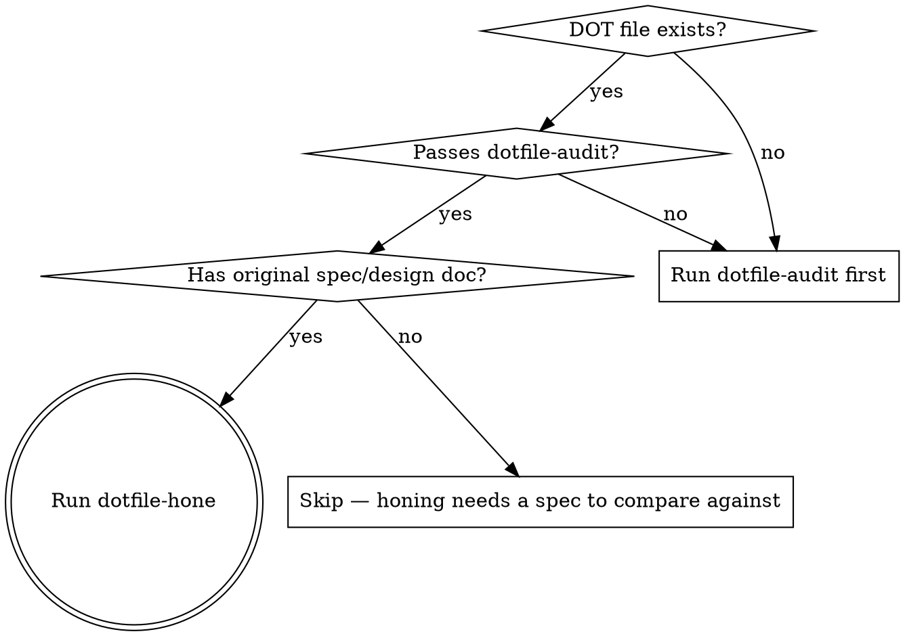

# dotfile-hone

Multi-pass deep refinement of pipeline DOT files. Goes beyond structural correctness (dotfile-audit) to catch flow inefficiencies, spec information loss, and missing domain invariants in prompts.

**REQUIRED BACKGROUND:** Run `dotfile-audit` first. This skill assumes structural validation already passes.

## When to Use



## Process Overview

Four passes, each catching progressively subtler issues:

| Pass | Focus | Catches |
|------|-------|---------|
| 1. Flow Analysis | Dependency graph optimization | Unnecessary serialization, missing selective joins |
| 2. Reverse Spec Test | Information loss detection | Domain rules lost in spec→plan→prompt telephone game |
| 3. Invariant Embedding | Prompt enrichment | Missing data models, permissions, enums, field schemas |
| 4. Verification | Confirm fixes worked | Remaining gaps after embedding |

## Pass 1: Flow Analysis

Analyze the dependency graph for unnecessary serialization and optimization opportunities.

### Check Fan-out/Fan-in Efficiency

For each fan-in (tripleoctagon) node, ask: **Does every incoming track actually need to wait for every other track?**

```
# BAD: Monolithic fan-in forces unnecessary waiting
fanout_L2 -> impl_tasks;
fanout_L2 -> impl_bugs;
fanout_L2 -> impl_memory;
fanout_L2 -> impl_search;
impl_tasks -> fanin_all;    # Memory doesn't need Tasks
impl_bugs -> fanin_all;     # Memory doesn't need Bugs
impl_memory -> fanin_all;   # Search doesn't need Memory
impl_search -> fanin_all;

# GOOD: Selective joins — only wait for actual dependencies
impl_tasks -> boards_ready;     # Boards needs Tasks + Bugs
impl_bugs -> boards_ready;
boards_ready -> impl_boards;

impl_entity_index -> impl_memory;   # Memory only needs Entity Index
impl_entity_index -> impl_search;   # Search only needs Entity Index
```

### Check Sequential vs Parallel

For each sequential edge (A -> B), ask: **Does B actually depend on A's output?**

If not, both should be in a fan-out. Common false dependencies:
- Components that share a foundation but don't need each other
- Test/verify nodes that could run in parallel across independent components

### Print Flow Analysis

```
Fan-out efficiency:
  [x] fanout_L1: 3 tracks, all independent — correct
  [ ] fanin_all: 10 inputs, but Memory only needs Entity Index — add selective join
  [ ] impl_boards: waits for all L2, but only needs Tasks + Bugs — add selective join

Sequential dependencies:
  [x] setup -> plan: correct, plan needs scaffolding
  [ ] impl_memory -> impl_search: false dependency, both only need Entity Index
```

## Pass 2: Reverse Spec Test

The most powerful technique. Dispatch a subagent to reverse-engineer a spec from ONLY the DOT file, then compare against the original spec.

### Why This Works

Prompts are the DOT file's "unit tests" — they're what agents actually execute. If a domain rule isn't in the prompt, it won't be implemented. The reverse spec test catches information that was in the original spec but got lost during generation.

### How to Run

Dispatch a subagent with this prompt:

```
Read the file <dot_file_path>. From ONLY the DOT file (do not read any other files),
reverse-engineer a complete project specification. Extract:

1. Product overview and goals
2. Architecture and tech stack
3. Data model (all collections/tables, their fields, types, relationships)
4. Permission/access control rules
5. API surface (endpoints, commands, operations)
6. Business logic and invariants
7. Enums and status values
8. Testing strategy
9. Quality requirements

Be as detailed as possible. Extract every concrete detail from the node prompts.
Write the result to docs/plans/reverse_spec.md
```

### Compare Against Original

After the subagent writes the reverse spec, compare it against the original spec section by section:

| Section | Original Spec | Reverse Spec | Gap? |
|---------|--------------|--------------|------|
| Collections | 12 collections with full field schemas | 8 collections, fields vague | YES — 4 collections missing from prompts |
| Permissions | 5 scope rules with actorType logic | "org/team/private scoping" | YES — actorType enum missing |
| Enums | status: open/in_progress/done/archived | "various statuses" | YES — specific values missing |
| Field schemas | createdAt, updatedAt, ownerActorId? | Not mentioned | YES — field-level detail missing |

**Every gap = information loss.** The agent building from this pipeline won't know these rules.

## Pass 3: Invariant Embedding

Fix the gaps found in Pass 2 by embedding critical domain rules directly into component prompts.

### What to Embed

Embed rules that are:
- **Critical for correctness** (wrong = broken app, not just ugly)
- **Not derivable from context** (agent can't figure it out from code alone)
- **Specific and concrete** (collection paths, field names, enum values — not "handle errors appropriately")

### Categories of Invariants

| Category | Example | Where to Embed |
|----------|---------|---------------|
| Collection/table paths | `orgs/{orgId}/tasks/{taskId}` | Every component that touches that collection |
| Permission rules | "admin reads private, members read org/team only" | Every component with scoped access |
| Field schemas | `ownerActorId?: string`, `actorType: human\|agent` | Components that create/update records |
| Status enums | `open \| in_progress \| done \| archived` | Components that set or filter by status |
| Relationship rules | "DMs deduplicated by sorted participant IDs" | Components that create relationships |
| Immutability rules | "createdAt and createdBy are never updated" | Components that update records |
| Security invariants | "webhook tokens are hashed with SHA-256" | Components that handle auth |

### Embedding Pattern

Add a `## Core Invariants` section to each implement node's prompt:

```
prompt="You are working in `run.working_dir`.

## Task
Implement the Tasks component...

## Core Invariants
These rules MUST be followed exactly:

### Firestore Paths
- Tasks: `orgs/{orgId}/tasks/{taskId}`
- Comments: `orgs/{orgId}/tasks/{taskId}/comments/{commentId}`

### Fields (Tasks)
- id, title, description, status, priority, assigneeActorId?
- ownerActorId: string (required)
- actorType: 'human' | 'agent'
- scope: 'org' | 'team' | 'private'
- createdAt, updatedAt: Timestamp (createdAt is immutable)

### Permission Rules
- scope='private': only ownerActorId can read/write
- scope='team': team members can read, owner can write
- scope='org': all org members can read, owner can write
- Admins can read ALL scopes

### Status Enum
open -> in_progress -> done -> archived (no skipping)

## Process
1. Write failing tests FIRST...
"
```

### Scope by Component

Don't dump ALL invariants into every prompt. Each component gets only the invariants relevant to it. A "Search" component doesn't need "DM deduplication rules."

## Pass 4: Verification Reverse Spec Test

Re-run the reverse spec test from Pass 2 after embedding invariants.

### Expected Improvement

The reverse spec should now capture most domain rules. Compare again:

| Section | Before Embedding | After Embedding |
|---------|-----------------|-----------------|
| Collections | 8/12 captured | 12/12 captured |
| Permissions | Vague mention | Specific rules with actorType |
| Enums | "various statuses" | Exact values listed |
| Field schemas | Not mentioned | Full field lists |

### Remaining Gaps

Some gaps are acceptable:
- **Architectural rationale** (why Firestore vs Postgres) — agents don't need this
- **Future roadmap** — not relevant to v1 build
- **Non-functional requirements** (latency targets) — hard to embed in prompts

Significant gaps should be fixed:
- **Missing scope/permission for a component** — will produce wrong security rules
- **Wrong enum values** — will produce broken state machines
- **Missing field** — will produce incomplete data model

## Checklist

1. [ ] Confirm dotfile-audit passes (prerequisite)
2. [ ] **Pass 1:** Flow analysis — check fan-out/fan-in efficiency, false sequential dependencies
3. [ ] Fix flow issues (add selective joins, parallelize independent components)
4. [ ] **Pass 2:** Dispatch subagent for reverse spec test
5. [ ] Compare reverse spec against original — catalog gaps
6. [ ] **Pass 3:** Embed core invariants into component prompts
7. [ ] **Pass 4:** Re-run reverse spec test to verify gaps closed
8. [ ] Compare before/after — confirm improvement
9. [ ] Run `dotfile validate` to confirm no structural regressions
10. [ ] Present summary: what was found, what was fixed, what gaps remain

## Common Mistakes

| Mistake | Fix |
|---------|-----|
| Dumping all invariants into every prompt | Scope invariants per component — only include what's relevant |
| Embedding vague rules ("handle errors properly") | Embed specific, concrete rules (collection paths, field names, enum values) |
| Skipping the reverse spec test | The whole point is measuring information loss objectively — don't skip it |
| Not re-running reverse spec after fixes | You need to verify the fixes actually closed the gaps |
| Breaking structural validation with prompt changes | Run `dotfile validate` after every pass |
| Treating flow analysis as optional | Unnecessary serialization doubles pipeline wall-clock time |
| Embedding architectural rationale | Agents need rules, not reasons. "Use Firestore" not "We chose Firestore because..." |
