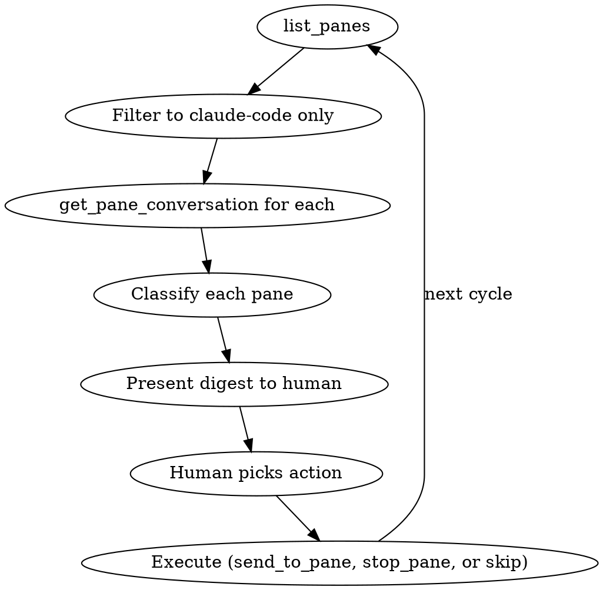

# Fleet Manager

Manage a fleet of AI coding agents running in tmux panes using the `control` MCP tools.

## The Loop



## Step 1: Gather

Call `list_panes` with no filters. Then for each claude-code pane, call `get_pane_conversation` (count: 10) to get recent context.

## Step 2: Classify

Read each conversation and classify:

| Status | Signal | What it means |
|--------|--------|--------------|
| **Working** | Recent tool calls, thinking, actively producing output | Leave it alone |
| **Needs input** | Asked a question, waiting for user response, permission prompt | Human needs to respond |
| **Stuck** | Repeated errors, retrying same thing, no progress in last few messages | May need redirection |
| **Idle** | At the prompt, no recent activity, conversation ended | Available for new work |
| **Done** | Completed its task, committed, reported back | Can be stopped or given new work |

Use your judgment. Read the conversation content — don't just look at the status line.

## Step 3: Present Digest

Format as a brief table:

```
Fleet Status: 5 claude-code panes

  %4  nl          Working    editing graph layout code
  %19 tracker     Needs input  asking about test strategy
  %20 barnstormer Idle       at prompt, finished last task
  %50 hex         Stuck      retrying failed SSH connection
  %79 dot-files   Done       committed linting fixes

1 needs your input, 1 looks stuck. Want me to handle any of these?
```

Keep descriptions to ~5 words. The human wants a glance, not a novel.

## Step 4: Act

When the human says to act on a pane:

- **Respond to a question**: `send_to_pane` with the answer
- **Redirect a stuck agent**: `send_to_pane` with new instructions ("try a different approach — skip the SSH and test locally instead")
- **Give idle agent work**: `send_to_pane` with a new task
- **Stop a done agent**: `stop_pane`
- **Read more context**: `get_pane_conversation` with higher count (30-50)

When sending to a pane, be direct. The text you send is typed into the pane and Enter is pressed. Write it like you're talking to the agent.

## Autonomous Mode

If the human says "handle it" or "you decide":

- **Needs input**: Only respond if you can confidently answer from context. If unsure, flag it for the human.
- **Stuck**: Suggest an alternative approach via `send_to_pane`.
- **Idle**: Ask the human what to assign. Don't invent work.
- **Done**: Leave it. Don't stop unless asked.

Never stop a working agent autonomously. Never send instructions you're unsure about.

## Quick Commands

| User says | What to do |
|-----------|-----------|
| "check on my agents" | Full loop: list, classify, digest |
| "what needs attention" | Same, but only show needs-input and stuck |
| "brief me" | Full digest with one-line summaries |
| "handle the stuck ones" | Read stuck conversations, send redirections |
| "send X to the tracker agent" | `send_to_pane` using project name fuzzy match |
| "stop the idle ones" | `stop_pane` for each idle pane |
| "what's %4 doing" | `get_pane_conversation` for that specific pane |

## Prerequisites

The `control` daemon must be running and the MCP server registered. If tools aren't available, tell the user:

```
The control MCP tools aren't available. Make sure:
1. The daemon is running: control daemon start --background
2. MCP is registered in ~/.claude/settings.json
```
