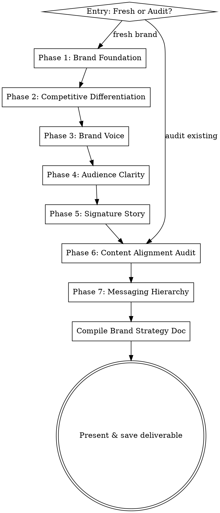

# Personal Branding

Build a distinctive personal brand through 7 sequential phases. Each phase gathers input conversationally, produces a deliverable, and feeds into the next.

## When to Use

- Building a personal brand from scratch
- Refining or repositioning an existing brand
- Auditing whether current content matches desired positioning
- Defining brand voice, audience, or messaging hierarchy

## When NOT to Use

- Company/product branding (this is for individuals)
- One-off content creation (use snowball-content instead)
- Marketing strategy beyond personal positioning (use marketing-audit or gtm-partner)

## Process Flow



## Entry Point

Ask: "Are you building a brand from scratch, or do you already have a presence you want to audit and refine?"

- **Fresh:** Start at Phase 1
- **Audit:** Start at Phase 6, then loop back to fill gaps

## Phase 1: Brand Foundation

**Goal:** Define the core of who you are professionally.

Gather through conversation (one question at a time):
- What do you do? (elevator pitch)
- Who do you serve?
- What makes your approach different from others in your space?
- How long have you been doing this?

**Produce:**
- One-sentence brand promise
- 3 core themes you stand for
- The one problem you're the go-to person to solve
- The emotion you want people to feel after reading your content

**Quality check:** The brand promise should be specific enough that only this person could own it. If it could describe anyone in their field, push harder on differentiation.

Present the deliverable. Get approval before proceeding.

## Phase 2: Competitive Differentiation

**Goal:** Find the white space in your field.

Gather:
- "Name 3-5 people in your space whose work you respect. Share their profile URLs or paste their bios/headlines."
- If URLs provided, use agent-browser to scrape their bios and headlines

**Produce:**
- What competitors all have in common (what NOT to copy)
- The white space (positioning none of them own)
- 3 positioning directions ranked by distinctiveness, with your recommendation

**Reference Phase 1 output** to ensure positioning directions align with the brand foundation.

Present the deliverable. Get approval before proceeding.

## Phase 3: Brand Voice

**Goal:** Define HOW you write, not what you write about.

Gather:
- "Share 3-5 samples of your writing. Posts, emails, messages, anything in your natural voice."
- Accept pasted text, URLs to posts, or informal descriptions

**Produce:**
- Voice defined in 4 words
- What the voice sounds like in practice (1-2 sentences)
- 3 sentences you WOULD write
- 3 sentences you would NEVER write

This becomes the filter for all future content.

Present the deliverable. Get approval before proceeding.

## Phase 4: Audience Clarity

**Goal:** Define WHO you're writing for — psychographic, not demographic.

Gather:
- "What do you currently post about?"
- "Share 2-3 comments or DMs that felt like exactly the right person responding."

**Produce a psychographic profile:**
- Who is this person?
- What do they believe?
- What frustrates them?
- What do they secretly want?
- What would make them share your post without being asked?

**Reference Phase 1** (who you serve) and **Phase 3** (voice) to ensure alignment.

Present the deliverable. Get approval before proceeding.

## Phase 5: Signature Story

**Goal:** Find and craft the one defining story that anchors your brand.

Gather:
- "Tell me about 3 pivotal moments in your career — turning points, hard decisions, unexpected lessons."

**For each moment, identify:** the tension, the decision, the shift.

**Produce:** The strongest one crafted as a post:
- 150 words max
- First line must NOT start with "I"
- Ends with a belief you now hold because of this experience
- Written in the brand voice from Phase 3

Present the deliverable. Get approval before proceeding.

## Phase 6: Content Alignment Audit

**Goal:** Bridge the gap between current content and desired positioning.

Gather:
- "Share your last 10 posts, or give me your profile URL and I'll pull them."
- If URL provided, use agent-browser to scrape recent posts
- If entering here as the starting point (audit path), gather enough context about desired positioning first

**Produce:**
- Which posts are on-brand and why
- Which posts are off-brand and what they signal instead
- What a stranger would think your brand is based only on these posts
- 3 post topics that would close the gap between current and desired positioning

Present the deliverable. Get approval before proceeding.

## Phase 7: Messaging Hierarchy

**Goal:** Build a 3-level messaging system applied across platforms.

**Auto-references all prior phase outputs.** No new gathering needed — this synthesizes everything.

**Produce:**

| Level | Message | Where It Shows Up |
|-------|---------|-------------------|
| Functional | What you do | Headline, bio |
| Methodological | How you do it differently | About section, intro posts |
| Philosophical | Why it matters | Post openers, keynotes |

Each level is one clear sentence. Then show how all 3 levels appear in:
- A headline
- An about/bio section (first paragraph)
- A typical post opener

Present the deliverable. Get approval before proceeding.

## Final Deliverable

After all phases, compile everything into a single Brand Strategy Document:

```markdown
# Brand Strategy: [Name]
Generated: [date]

## 1. Brand Foundation
- **Brand Promise:** ...
- **Core Themes:** ...
- **Go-To Problem:** ...
- **Desired Emotion:** ...

## 2. Positioning
- **White Space:** ...
- **Chosen Direction:** ...
- **Avoid:** ...

## 3. Brand Voice
- **Voice in 4 Words:** ...
- **Sounds Like:** ...
- **I Would Write:** ...
- **I Would Never Write:** ...

## 4. Audience
- **Psychographic Profile:** ...
- **Share Trigger:** ...

## 5. Signature Story
[The crafted story post]

## 6. Content Alignment
- **On-Brand:** ...
- **Off-Brand:** ...
- **Gap-Closing Topics:** ...

## 7. Messaging Hierarchy
| Level | Message | Applied To |
|-------|---------|------------|
| Functional | ... | Headline |
| Methodological | ... | About section |
| Philosophical | ... | Post openers |
```

Ask where to save. Default: `~/Documents/brand-strategy-[name].md`

## Key Rules

- **One question at a time.** Do not dump all questions for a phase at once.
- **Present each phase deliverable and get approval** before moving to the next.
- **Reference prior phases.** Each phase builds on the last — voice should reflect foundation, audience should align with positioning, story should embody the brand.
- **Platform-flexible.** The framework works for LinkedIn, X, personal sites, YouTube — ask which platforms matter and adapt the messaging hierarchy output accordingly.
- **Push on specificity.** Generic positioning is worthless. If a deliverable could describe anyone in the field, it needs more work.
- **Browser-assist when possible.** If the user provides URLs for competitors (Phase 2) or their own profile (Phase 6), use agent-browser to pull content rather than making them paste it manually.
