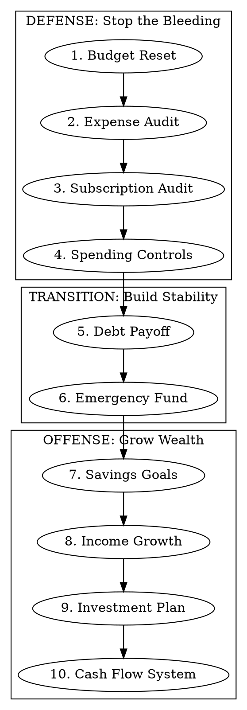

# Personal Finance Planning

## Overview

A structured workflow for building a complete personal money system. Works through 10 financial domains in priority order — defense first (stop leaks), then offense (grow wealth). Each phase gathers real numbers, produces concrete artifacts, and feeds into the next.

## When to Use

- Setting up or resetting a personal budget
- Auditing spending and finding waste
- Planning debt payoff strategy
- Building savings goals or emergency fund
- Starting an investment plan
- Any "help me get my money right" request

## The Workflow

Work in priority order. Defense phases (1-4) plug holes. Transition phases (5-6) build stability. Offense phases (7-10) grow wealth. Skip phases the user doesn't need, but always suggest the next logical one.

### Before Starting: Gather Context

Collect what you need for the relevant phases — don't demand everything upfront:
- Monthly income (all sources)
- Recent spending data (statements, app exports, or estimates)
- Current debts (balances, interest rates, minimums)
- Existing savings and investments
- Financial goals and timelines

### Phase 1: Budget Reset

Categorize actual spending (not aspirational) into needs/wants/savings. The 50/30/20 split is a starting framework — adjust based on the user's real situation (high-COL areas may need 60/20/20). Output a concrete allocation with dollar amounts, not just percentages. Include automation rules for recurring transfers.

### Phase 2: Expense Leak Finder

Audit spending history to surface hidden waste: forgotten recurring charges, impulse patterns, food waste, bill overpayments. Rank findings by recoverable dollars/month. The average person has ~12 subscriptions they've forgotten — look for those.

### Phase 3: Subscription Audit

Use Sort-Score-Simplify: sort all recurring charges, score each 0-5 on actual usage, simplify by cutting low-scorers. Categorize as Essential / Nice-to-have / Ghost (paying but never using). Calculate projected annual savings from cuts. Provide cancellation steps for each cut.

### Phase 4: Spending Controls

Build behavioral systems that don't rely on willpower: purchase delay rules (wait a week for wants, a month for big items), debit-only trial periods, category spending alerts. Create a 30-day spending reset calendar with daily check-ins. The goal is changing defaults, not white-knuckling.

### Phase 5: Debt Payoff

Compare snowball (smallest balance first — psychological wins) vs avalanche (highest interest first — mathematical optimal). Present both with timelines and total interest paid. Build a tracker showing monthly allocation across debts. Most people do better with snowball despite paying more interest — the motivation matters.

### Phase 6: Emergency Fund

Build in tiers: first $1,000 fast (starter emergency fund), then 3 months of expenses, then 6 months. Set up automated contributions (10-20% of income). Recommend high-yield savings accounts for the fund. Include progress milestones and a "what counts as emergency" definition to prevent raids.

### Phase 7: Savings Goals

For each named goal (vacation, house, car, etc.): calculate monthly contribution needed given target amount and date. Build a tracker with milestones. Set up dedicated sub-accounts or buckets. Include motivation triggers at 25%/50%/75% marks.

### Phase 8: Income Growth

Map the user's skills to income opportunities. Rank by time-to-first-dollar, startup cost, and weekly hour commitment. Cover side hustles, skill monetization, freelancing, and passive income streams. Build a 90-day launch sequence for the top pick. Be realistic about timelines — most passive income takes 6-12 months of active work first.

### Phase 9: Investment Starter

For beginners: prioritize tax-advantaged accounts (employer 401k match first, then Roth IRA, then HSA if eligible). Recommend broad index funds/ETFs over individual stocks. Explain dollar-cost averaging. Build a 6-month contribution ramp-up schedule. Match recommendations to stated risk tolerance.

### Phase 10: Cash Flow System

Build the ongoing monitoring layer: income vs expense trend tracking, category breakdowns, goal progress forecasts, surplus/deficit alerts. Create a weekly 15-minute review checklist. This is the "dashboard" that keeps all other phases on track.

## Quick Reference

| Phase | Focus | Key Question | Key Output |
|-------|-------|-------------|------------|
| 1 | Budget | Where does money actually go? | Allocation table + automation rules |
| 2 | Leaks | What am I wasting? | Ranked elimination plan |
| 3 | Subs | What am I paying for but not using? | Scored audit + cancellation list |
| 4 | Controls | How do I change spending habits? | 30-day reset calendar |
| 5 | Debt | Which debts first? | Snowball vs avalanche comparison |
| 6 | Emergency | How do I build a safety net? | Tiered savings plan |
| 7 | Goals | How do I save for X by Y? | Goal tracker + milestones |
| 8 | Income | How do I earn more? | 90-day launch plan |
| 9 | Investing | How do I start investing? | Account + fund recommendations |
| 10 | Cash Flow | How do I stay on track? | Weekly review checklist |

## Common Mistakes

- **Generic advice without real numbers:** Always use the user's actual figures. "$200/month to savings" beats "save more."
- **Skipping defense before offense:** Find the leaks (phases 1-4) before trying to grow wealth (7-10). Freed-up cash accelerates everything.
- **All 10 phases at once:** 2-3 phases per session max. Financial planning is mentally taxing and action-dependent — each phase may need a week of real-world data before the next makes sense.
- **Ignoring behavioral design:** Systems beat willpower every time. Automation, defaults, and friction are more reliable than motivation.
- **Presenting one "right" answer:** Financial decisions involve values and risk tolerance. Present options with trade-offs, let the user decide.

## Disclaimer

This skill produces financial organization tools and frameworks, not professional financial advice. Recommend the user consult a qualified financial advisor for investment decisions, tax strategy, and complex debt situations.
