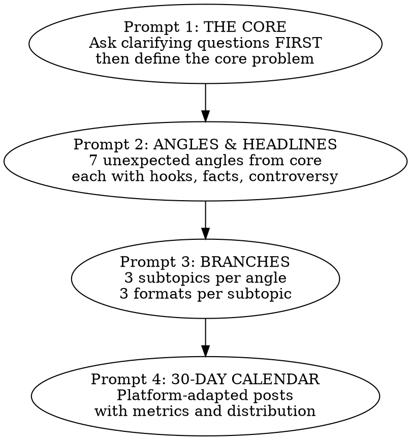

# The Snowball Method

Turn 1 topic into 40+ content pieces across platforms using a 4-prompt sequential pipeline.

## The Pipeline

This is a **sequential 4-prompt process**. Each prompt builds on the previous output. Do NOT skip steps or combine them.

## Prompt 1: THE CORE

**You MUST ask clarifying questions before producing output.** Do not skip this.

Ask about:
- Goal (what outcome does this content serve?)
- Target audience (who specifically?)
- Pain points (what keeps them up at night?)
- Constraints (budget, team size, tools available?)
- Tone (professional, casual, provocative, educational?)
- Platforms (Threads, Reels, TikTok, LinkedIn, email, YouTube?)

After receiving answers, deliver:

| Deliverable | Spec |
|-------------|------|
| Core problem | One specific problem people discuss and share |
| Why it matters | 2-3 sharp sentences |
| 30-day content goals | Measurable outcomes (saves, leads, shares — not vanity metrics) |
| ICP table | See format below |

**ICP Table Format:**

| Who | What they want | What blocks them | Their language | Triggers | Taboos |
|-----|---------------|-----------------|----------------|----------|--------|

Be specific. Generic personas ("busy professionals") fail. Use language the audience actually uses.

## Prompt 2: ANGLES & HEADLINES

Generate **7 unexpected angles** from the core problem. Each angle must be:
- Counterintuitive, OR
- "You're doing it wrong", OR
- Myth vs reality, OR
- Hidden cost of the usual solution

**For each angle, provide ALL of these:**

| Element | Constraint |
|---------|-----------|
| 2 hooks | Each ≤12 words, platform-ready (Threads/Reels) |
| 1 core insight | ≤80 words |
| 1 number/fact | With source citation — see Credibility Gate below |
| 1 controversial statement | Designed to spark comments |

**Credibility Gate (mandatory for every angle's number/fact):**

Write exactly one line in this form:
> `Source: [publication/study/author, year] — [one-sentence fact]`

**Fail condition:** If no verifiable source exists for the claimed fact, the angle is **blocked**. Do not proceed with that angle until a real source is supplied. Generate a replacement angle if needed.

**The 7 angles must not overlap.** If two angles feel similar, cut one and find something sharper.

## Prompt 3: BRANCHES

For each of the 7 angles, create **3 subtopics**. Each subtopic must pass the **Cliche Inversion Gate** before proceeding:

**Cliche Inversion Gate (mandatory for every subtopic):**
1. Write a one-sentence "Obvious Version" — the cliche take a mediocre writer would produce on this subtopic.
2. Write a one-sentence "Inversion Statement" in this exact form: *"Unlike [obvious version], this subtopic argues/shows [specific contradiction]."*
3. If the Inversion Statement cannot be completed with a concrete contradiction (a negation like "not X" does not count — it must assert something specific and different), the subtopic is rejected. Generate a replacement and repeat.

Show both sentences inline before presenting each subtopic's formats. A reviewer must be able to verify the gate passed without knowing the method.

For each subtopic that passes the gate, create **3 formats:**

### Format 1: Educational
- Hook (≤2 lines)
- Insight (≤80 words)
- 3 concrete "do this today" steps

### Format 2: Provocative
- Debatable hook
- 3 supporting proofs
- Question at the end (drives comments)

### Format 3: Case Study
- Context (situation before)
- Action (what changed)
- Numbers (measurable result)
- Takeaway (one sentence)

If data is missing for case studies, ask the user — do not fabricate numbers.

## Prompt 4: 30-DAY CALENDAR

For each piece of content from Prompt 3, adapt for the user's specified platforms:
- Adjust length per platform norms
- Specify visual format (carousel, reel, text post, thread, etc.)
- Include a CTA appropriate to the platform
- Define a success metric for each post

Build the calendar as a table:

| Date | Platform | Topic | Angle | Format | Goal/Metric | Distribution Notes |
|------|----------|-------|-------|--------|-------------|-------------------|

**Calendar rules:**
- Remove repetition — no two posts should feel like the same take
- Alternate topics to avoid audience fatigue
- Note repurposing opportunities (clips, carousels from long-form, etc.)
- Front-load problem-awareness content, back-load solution content

## Common Mistakes

| Mistake | Fix |
|---------|-----|
| Generic angles | "5 tips for X" is not an angle. Push for counterintuitive, myth-busting, or hidden-cost framing. |
| Inversion Statement that merely negates | "Unlike X, this shows not-X" fails the gate. The contradiction must assert something specific. |
