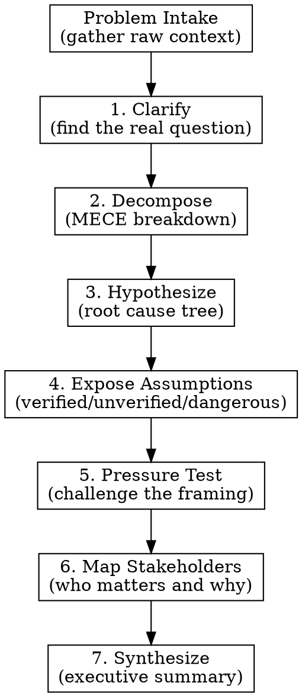

# Strategy Diagnosis

Structured diagnostic pipeline that applies consulting-grade analytical frameworks to any business or strategic problem. Seven lenses, applied sequentially, each building on the last.

## When to Use

- Someone describes a business problem and needs clarity
- A founder is stuck and can't see the real issue
- Strategic decision with too many variables
- "I know something's wrong but can't articulate it"
- Need to pressure-test your own thinking

## The Pipeline



## How to Run

### Phase 0: Problem Intake

Before any analysis, get the raw material. Ask the user:

> "Describe the problem you're facing. Include as much context as you want - the messy version is fine. What's happening, what you've tried, what's frustrating you. Don't worry about structure, that's my job."

If they give a one-liner, probe:
- "What does this look like day-to-day?"
- "How long has this been going on?"
- "What have you already tried?"
- "What happens if you do nothing?"

**Do not proceed until you have enough context to work with.** A sentence is not enough. You need the messy reality.

### Phase 1: Core Question Clarifier

Strip away symptoms, emotions, and noise. Restate their problem as a single, crisp strategic question.

**Output format:**
```
CORE QUESTION: [One sentence. The actual decision that needs to be made.]

WHAT I STRIPPED AWAY:
- [Symptom vs. cause distinctions]
- [Emotional framing that was obscuring the real issue]
- [Adjacent problems that are separate concerns]
```

Present this to the user. Ask: "Does this feel right? Am I seeing the real problem, or did I miss something?"

**Do not proceed without confirmation.** This is the foundation - if it's wrong, everything downstream is wrong.

### Phase 2: MECE Decomposition

Break the confirmed core question into mutually exclusive, collectively exhaustive components.

**Rules:**
- No overlaps between buckets (mutually exclusive)
- No gaps - every aspect of the problem fits somewhere (collectively exhaustive)
- 3-5 buckets is the sweet spot. More than 6 means you're too granular.

**Output format:**
```
COMPONENT BREAKDOWN:

1. [Bucket name]: [What this contains and why it's distinct]
2. [Bucket name]: [What this contains and why it's distinct]
3. [Bucket name]: [What this contains and why it's distinct]
...

EXHAUSTIVENESS CHECK: [What would fall through the cracks if any bucket were removed?]
```

### Phase 3: Hypothesis Tree

For each MECE bucket, generate the most likely root cause hypotheses.

**Output format:**
```
HYPOTHESIS TREE:

Bucket 1: [name]
  H1a: [Hypothesis]
    - Evidence FOR: [what you'd expect to see if true]
    - Evidence AGAINST: [what you'd expect to see if false]
    - How to test: [cheapest way to validate]
  H1b: [Hypothesis]
    ...

Bucket 2: [name]
  H2a: ...
```

**Rank hypotheses** within each bucket by plausibility given the context provided. Bold the most likely candidate across all buckets.

### Phase 4: Assumption Exposure

Surface every assumption embedded in the problem framing, the user's context, and the hypotheses.

**Classify each as:**
- **Verified**: Evidence exists. State the evidence.
- **Unverified**: Plausible but untested. Flag what test would verify it.
- **Dangerous**: If wrong, the entire strategy collapses. These get special attention.

**Output format:**
```
ASSUMPTIONS:

DANGEROUS (strategy-collapsing if wrong):
- [Assumption]: Why it's dangerous. How to verify.

UNVERIFIED (plausible but untested):
- [Assumption]: What test would confirm/deny.

VERIFIED (evidence exists):
- [Assumption]: Evidence.
```

### Phase 5: Diagnosis Pressure Test

Now attack your own analysis. Play the role of a skeptical senior partner.

**Challenge:**
- Is the core question actually the right question?
- Are the MECE buckets truly exhaustive, or is there a blind spot?
- Which hypothesis are you most biased toward, and why?
- What's the most uncomfortable alternative explanation?
- What would a competitor or adversary say about this framing?

**Output format:**
```
PRESSURE TEST:

BLIND SPOTS IDENTIFIED:
- [What the analysis might be missing]

BIAS CHECK:
- [Where confirmation bias or anchoring might be at play]

STRONGEST COUNTER-ARGUMENT:
- [The best case against the leading hypothesis]

REFRAME OPPORTUNITY:
- [An entirely different way to look at the problem, if one exists]
```

### Phase 6: Stakeholder Impact Map

Map the human landscape around this problem.

**Output format:**
```
STAKEHOLDER MAP:

MUST CHANGE BEHAVIOR:
- [Who]: What behavior needs to change. What motivates them.

MUST BUY IN:
- [Who]: Why their buy-in matters. What they care about.

LIKELY TO RESIST:
- [Who]: Why they'd resist. What would neutralize resistance.

AFFECTED BUT NOT INVOLVED:
- [Who]: How they're impacted. Whether that matters.
```

### Phase 7: Executive Synthesis

Compress the entire analysis into a one-page executive summary.

**Output format:**
```
EXECUTIVE SUMMARY

CORE QUESTION: [From Phase 1]

KEY COMPONENTS: [3-5 bullets from Phase 2]

LEADING HYPOTHESIS: [From Phase 3, with confidence level]

CRITICAL ASSUMPTIONS TO TEST: [Top 2-3 from Phase 4]

BIGGEST BLIND SPOT: [From Phase 5]

KEY STAKEHOLDER MOVE: [The single most important stakeholder action from Phase 6]

RECOMMENDED NEXT STEP: [One concrete action to take in the next 48 hours]

WHAT CHANGES EVERYTHING: [The one thing that, if true, would require a complete rethink]
```

## Pacing

- Present each phase's output before moving to the next
- Invite brief reactions ("Does this track?" / "Anything surprise you?") but don't turn each phase into a long discussion
- The whole pipeline should feel like momentum, not a committee meeting
- If the user wants to drill into one phase, do it, then resume the pipeline

## When to Stop Early

- If Phase 1 reveals the problem is actually simple and the answer is obvious, say so. Don't run 7 phases to justify a one-sentence answer.
- If the user realizes during any phase that they already know what to do, celebrate that and stop.

## Common Mistakes

- **Starting analysis before getting enough context**: Phase 0 matters. Don't skip it.
- **Accepting the user's problem framing uncritically**: Phase 1 exists because people often describe symptoms, not causes.
- **MECE buckets that overlap**: If you can't clearly explain why two buckets are distinct, merge them.
- **Hypotheses without testability**: Every hypothesis needs a "how to test" or it's just speculation.
- **Skipping the pressure test**: Phase 5 is where intellectual honesty lives. Don't phone it in.
