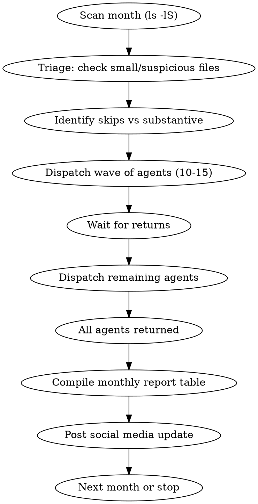

# Summarize Meetings

Process meeting transcripts from `Meetings/transcripts/` — extract people, action items, project ideas, blog ideas, knowledge graph connections, concepts, and general ideas. Populate the vault knowledge graph and generate rich summary files.

## Campaign Workflow

Processing works in **monthly batches**, most-recent month first. Each month follows this cycle:



### Step 1: Scan the Month

```bash
ls -lS "Meetings/transcripts/" | grep "YYYY-MM"
```

List all transcripts for the target month, sorted by size. This gives you:
- Total count of transcripts
- File sizes (critical for triage and agent instructions)
- Filenames for slug generation

### Step 2: Check for Existing Summaries

```bash
ls "Meetings/" | grep "YYYY-MM.*summary"
```

Skip any transcript that already has a corresponding summary file.

### Step 3: Triage

Before dispatching agents, manually check files that are suspicious:

| Signal | Action |
|--------|--------|
| **< 2K** | Read the file — likely empty stub or sparse notes |
| **2K-6K** | Skim the file — may be scheduling fragment, garbled recording, or logistics-only |
| **Filename says "untitled"** | Almost always empty — read to confirm |
| **Known non-meeting patterns** | Medical appointments, kid brainstorming, screen-sharing setup, recording process discussions |

**Skip criteria (with log entry):**
- Empty stubs (template only, no content)
- < 20 words of real content after frontmatter
- Garbled/corrupted recordings
- Scheduling fragments (just logistics, no substance)
- Medical/personal appointments
- Kid content (school brainstorming, etc.)
- Recording process discussions (just setting up Granola)
- Screen-sharing setup conversations

**Sparse but substantive notes** (like handwritten bullet points from a real meeting) should still be processed — even 1.2K of real fundraising notes is worth a summary.

### Step 4: Dispatch Parallel Agents

Spawn one Task agent per transcript using `subagent_type: general-purpose` with `mode: bypassPermissions` and `run_in_background: true`.

**Wave sizing:** Dispatch 10-15 agents per wave. Wait for returns, then dispatch remaining agents. This prevents overwhelming the system while maintaining parallelism.

**Large file instructions:** For files > 50K, include "read in chunks using offset/limit" in the agent prompt. For files > 100K, explicitly say "this is a large file — read in chunks of 500-1000 lines using offset/limit parameters."

**Agent prompt template:**

```
You are a meeting summarizer for Doctor Biz's Obsidian vault at `/Users/harper/Public/Notes/Harper Notes/`.

Read the transcript at `[PATH]` ([SIZE] — [read in chunks if large]).

Then:
1. Extract: People, Action Items, Project Ideas, Blog Ideas, Knowledge Graph, Concepts, Ideas
2. Write summary to `Meetings/YYYY-MM-DD-slugified-name-summary.md`
3. Create/update People notes in `People/Firstname Lastname.md` (Title Case) — check if they exist first
4. Create Concept notes in `Concepts/` for genuinely reusable insights

Use the full summary template with YAML frontmatter (title, date, tags, type, source, status, related).
Write a strong 2-4 paragraph narrative meeting summary.
Use `[[wiki-links]]` throughout.
Never fabricate info not in the transcript.
Don't create People stubs for first-name-only references.
```

### Step 5: Compile Monthly Report

After all agents return, present a summary table:

```
| Meeting | Date | People | Actions | Concepts | Status |
|---------|------|--------|---------|----------|--------|
| harper-john | Jan 31 | 1 | 5 | 3 | Done |
| untitled | Jan 15 | - | - | - | Skipped (empty) |
```

Include: total processed, total skipped (with reasons), and notable highlights (interesting concepts, key people).

### Step 6: Social Media Update

Post a completion update via `mcp__socialmedia__create_post` with:
- Month completed
- Count of summaries processed
- Notable highlights (key meetings, interesting concepts)
- Tags: `["meeting-summaries", "month-year", "vault-curation"]`

---

## Transcript Format: Granola

Most transcripts come from Granola and have this structure:

```yaml
---
doc_id: uuid
source: granola
created_at: ISO timestamp
title: Meeting Title
participants:
- Person Name
duration_seconds: N
labels: []
creator: '[[Harper Reed]]'
attendees:
- '[[Person Name]]'
summary_text: |-
  ### Section Header
  - Bullet points of AI-generated summary
generator: muesli 1.0
---

# Meeting Title

_Date: YYYY-MM-DD_

## Participants
- **Name**, Role, Company, (email)

## Notes
(Granola-captured notes — may be sparse or detailed)

---

## Transcript

Speaker 1: ...
Speaker 2: ...
```

**Key fields to use:**
- `attendees` — canonical list of who was there
- `summary_text` — Granola's AI summary (useful cross-reference but don't rely solely on it)
- `participants` — sometimes has role/company info
- The transcript body has the real content

**Common transcript quirks:**
- Speaker attribution may be missing or wrong
- Names may be misspelled or use nicknames
- Some transcripts lack `summary_text` entirely
- Very long transcripts (100K+) may have repetitive content from multi-hour sessions

---

## Determining "Substantive"

A note is **not substantive** if:
- Body content (after frontmatter) is only template skeleton with no filled-in content
- Body has fewer than 20 words of actual content (excluding headings, `---`, empty bullets)
- All discussion/notes sections are blank
- Content is garbled/corrupted (random characters, no coherent sentences)
- Content is purely logistics (scheduling, screen sharing setup)

Skip these with a log entry. Don't waste a summary on nothing.

---

## Extraction Categories

For each substantive meeting note, extract:

### 1. People
- Full names mentioned in content or attendees
- Role/company/context if discernible
- Relationship to Doctor Biz if clear

### 2. Action Items
- Explicit tasks (`- [ ]`, "need to", "should", "will", "action:")
- Owner if identifiable
- Due dates if mentioned
- Preserve existing Obsidian Tasks syntax items

### 3. Project Ideas
- Products, tools, apps, or ventures discussed
- Both existing projects and new ideas
- Brief description of what was discussed about each

### 4. Blog Ideas
- Topics worth writing about publicly
- Interesting takes or contrarian views expressed
- Experiences worth sharing

### 5. Knowledge Graph Ideas
- Connections between entities (people ↔ projects, concepts ↔ people)
- Relationships worth capturing as wiki-links
- Patterns across meetings (if processing a batch)

### 6. Concepts
- Mental models, frameworks, or reusable ideas
- Strategic insights or principles discussed
- Technical concepts worth an atomic note
- **Must be genuinely reusable** — not just a topic that was discussed
- **Check vault first** — enrich existing concept notes rather than creating duplicates

### 7. Ideas
- General ideas that don't fit the above categories
- Shower thoughts, brainstorms, what-ifs
- Anything interesting that was floated

---

## Vault Graph Updates

### People Notes

For each person extracted:

1. **Check** if `People/Firstname Lastname.md` exists (search case-insensitively, check aliases)
2. **If exists:** Add meeting reference to `related` frontmatter. Append new context to Notes section. Update `last-contact` if this meeting is more recent.
3. **If not exists and full name is known:** Create stub using Person template (below)
4. **If only first name:** Do NOT create a stub. Document them in the summary's people table with whatever context is available.

**Name resolution:**
- Transcript may misspell names — cross-reference with `attendees` frontmatter and existing vault notes
- Nicknames in transcript (e.g., "Dens" for Dennis Crowley, "JB" for John Borthwick) — match to existing People notes and add as aliases
- When uncertain if a first-name reference matches an existing person, note the ambiguity rather than guessing

**People note stub template:**

```yaml
---
title: "Firstname Lastname"
date: YYYY-MM-DD
tags: [people]
aliases: []
type: person
company: (if known from meeting)
role: (if known from meeting)
how-we-met: "Met in [[Meeting Note Title]] context"
last-contact: YYYY-MM-DD
status: active
related: ["[[Summary File]]"]
---

# Firstname Lastname

## Context
- **Company/Org:** (if known)
- **Role:** (if known)
- **How we met:** From [[Meeting Note Title]]

## Notes
- (context extracted from meeting)

## Key Quotes

## Action Items
```

**File naming:** `People/Firstname Lastname.md` — Title Case, NEVER kebab-case for people.

### Concept Notes

For concepts worth capturing in `Concepts/`:

**Before creating a new concept note:**
1. Search `Concepts/` for existing notes on the same topic
2. Check aliases and related terms
3. If a related concept exists, **enrich it** with new evidence/connections rather than creating a duplicate
4. Only create a new note if the insight is genuinely distinct and reusable

```yaml
---
title: "Concept Name"
date: YYYY-MM-DD
tags: [concept]
type: concept
status: active
related: ["[[Summary File]]", "[[Person Who Articulated It]]"]
---

# Concept Name

## What is it?
(extracted from meeting context)

## Why it matters
(inferred from discussion)

## Connections
- [[Summary File]]
- [[Person]] — who articulated or contributed to this concept

## Sources / References
- [[Summary File]] — extracted from meeting on YYYY-MM-DD
```

### Project Stubs

For projects mentioned that don't exist in `Projects/`:

```yaml
---
title: "Project Name"
date: YYYY-MM-DD
tags: [project]
type: project
status: active
started: YYYY-MM-DD
related: ["[[Summary File]]"]
---

# Project Name

Mentioned in [[Summary File]]: (brief context)
```

---

## Summary File Format

Write to: `Meetings/YYYY-MM-DD-slugified-meeting-title-summary.md`

**Slug generation:** Use the most descriptive part of the filename. Drop common prefixes like "hangout-", "call-", "harper-reed-and-". Keep it recognizable.

```yaml
---
title: "Summary: Meeting Title"
date: YYYY-MM-DD
tags: [meeting-summary]
type: meeting
source: "[[Original Transcript Filename]]"
status: reference
related: ["[[Person 1]]", "[[Project X]]", "[[Concept Y]]"]
---
```

```markdown
# Summary: Meeting Title

> Source: [[Original Transcript Filename]]
> Date: Month DD, YYYY
> Attendees: [[Person 1]], [[Person 2]]

## Meeting Summary

(A strong 2-4 paragraph narrative summary capturing the substance of the
conversation. What was the meeting about? What were the key themes? What
decisions were made or directions set? What was the energy/vibe? This should
read like a well-written meeting recap that someone who wasn't there could
read and fully understand what happened and why it mattered.)

## Key Topics

(Organized by discussion thread — use subheadings for distinct topics)

## People
| Person | Role/Context |
|--------|-------------|
| [[Person Name]] | context/role/relevance from this meeting |

## Action Items
- [ ] Task description — owner if known

## Project Ideas
- [[Project Name]] — what was discussed, potential next steps

## Blog Ideas
- **Idea title** — why it's worth writing about, angle to take

## Knowledge Graph
- [[Entity A]] ↔ [[Entity B]] — nature of relationship/connection

## Concepts
- [[Concept Name]] — brief description and why it matters

## Ideas
- Idea description — enough context to act on later

## Key Quotes
> "Notable quote" — [[Speaker]]
```

---

## What NOT To Do

- Never delete or modify the original transcript
- Never strip existing links or tags from the original
- Never create duplicate People notes — check existing vault first, use aliases
- Never create duplicate Concept notes — enrich existing ones instead
- Never modify Dataview or Tasks query blocks in any note
- Never fabricate information not present in the meeting notes — extract only what's there
- Don't create People stubs for ambiguous first-name-only references unless context makes identity clear
- Don't create concept notes for trivial or obvious things — only genuinely reusable insights
- Don't create concept notes that overlap significantly with existing ones — add to the existing note instead
- Don't process medical appointments, kid content, or recording setup conversations
- Don't rely solely on Granola's `summary_text` — always read the actual transcript
